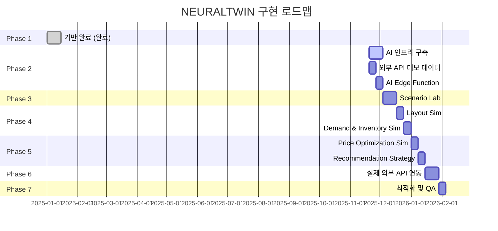

# NEURALTWIN 단계별 상세 개발 로드맵

**작성일**: 2025-11-20  
**총 기간**: 12주 (3개월)  
**현재 완료율**: 78% (18/23 페이지)

---

## 📊 현재 상태 요약

### 완료된 항목 ✅
- **Overview**: 4/4 페이지 (100%)
- **Analysis**: 8/8 페이지 (100%)
- **Data Management**: 5/5 페이지 (100%)
- **Simulation**: 1/6 페이지 (17%)

### 남은 작업 ❌
- **Simulation 섹션**: 5개 페이지 + AI 인프라
- **외부 API 연동**: 4개 Edge Functions
- **BigData API 실제 연동**: 백엔드 로직

---

## 🎯 전체 로드맵 개요



---

## 📅 Phase 2: AI Inference 인프라 구축 (2주)

**목표**: Simulation 섹션의 핵심 AI 추론 엔진 구축

### Week 1: 외부 API 데모 데이터 생성 (11/20 - 11/26)

#### Day 1-2: 데이터베이스 준비
**작업**:
1. ✅ 외부 컨텍스트 테이블 확인
   - `weather_data`
   - `holidays_events`
   - `economic_indicators`
   - `regional_data`

**산출물**:
```sql
-- 이미 존재하는 테이블들이므로 스키마 확인만 필요
SELECT * FROM weather_data LIMIT 1;
SELECT * FROM holidays_events LIMIT 1;
SELECT * FROM economic_indicators LIMIT 1;
SELECT * FROM regional_data LIMIT 1;
```

#### Day 3-4: 샘플 데이터 생성 스크립트
**작업**:
1. SQL 시드 스크립트 작성
2. 30일치 데모 데이터 생성
   - 날씨: 3시간 단위 (240개 레코드)
   - 공휴일/이벤트: 주요 이벤트 (10개)
   - 경제지표: 월별 (1-2개)
   - 지역 데이터: 주간 (4-5개)

**파일**:
```
docs/seed-external-context-data.sql
```

**샘플 데이터 구조**:
```sql
-- weather_data: 30일 × 8회(3시간 단위) = 240 rows
INSERT INTO weather_data (user_id, store_id, date, hour, temperature, humidity, precipitation, weather_condition)
VALUES 
  ('user-uuid', 'store-uuid', '2025-11-20', 0, 15.5, 65, 0, 'clear'),
  ('user-uuid', 'store-uuid', '2025-11-20', 3, 14.2, 68, 0, 'clear'),
  ...;

-- holidays_events: 주요 이벤트 10개
INSERT INTO holidays_events (user_id, date, event_name, event_type, impact_level)
VALUES 
  ('user-uuid', '2025-11-24', '블랙프라이데이', 'commercial', 'high'),
  ('user-uuid', '2025-12-25', '크리스마스', 'national_holiday', 'high'),
  ...;

-- economic_indicators: 월별 CSI, GDP 등
INSERT INTO economic_indicators (user_id, date, indicator_type, indicator_value, unit, region)
VALUES 
  ('user-uuid', '2025-11-01', 'consumer_sentiment_index', 98.5, 'index', 'KR'),
  ('user-uuid', '2025-11-01', 'retail_sales_index', 105.2, 'index', 'KR'),
  ...;

-- regional_data: 상권 유동인구 등
INSERT INTO regional_data (user_id, store_id, date, data_type, value, unit)
VALUES 
  ('user-uuid', 'store-uuid', '2025-11-20', 'foot_traffic', 15000, 'people/day'),
  ('user-uuid', 'store-uuid', '2025-11-20', 'commercial_sales', 2500000, 'KRW'),
  ...;
```

#### Day 5: 데이터 업로드 UI 개선
**작업**:
1. 외부 컨텍스트 데이터 임포트 기능 추가
2. 데이터 검증 및 프리뷰

**파일**:
```
src/features/data-management/import/components/ExternalContextUploader.tsx
```

**기능**:
- CSV/Excel 업로드 지원
- 날씨/이벤트/경제/지역 데이터 자동 분류
- 데이터 검증 (날짜 형식, 필수 필드)

---

### Week 2: AI Edge Function 구축 (11/27 - 12/3)

#### Day 1-3: `advanced-ai-inference` Edge Function 핵심 로직

**작업**:
1. Edge Function 생성
2. Lovable AI 연동 (google/gemini-2.5-pro)
3. 시나리오 타입별 분기 로직

**파일**:
```typescript
// supabase/functions/advanced-ai-inference/index.ts
import { serve } from "https://deno.land/std@0.168.0/http/server.ts";
import { createClient } from "https://esm.sh/@supabase/supabase-js@2";

const corsHeaders = {
  "Access-Control-Allow-Origin": "*",
  "Access-Control-Allow-Headers": "authorization, x-client-info, apikey, content-type",
};

interface SimulationRequest {
  scenarioType: 'layout' | 'demand' | 'pricing' | 'recommendation';
  storeId: string;
  parameters: Record<string, any>;
  timeHorizon?: number; // 예측 기간 (일)
}

serve(async (req) => {
  if (req.method === "OPTIONS") {
    return new Response(null, { headers: corsHeaders });
  }

  try {
    const { scenarioType, storeId, parameters, timeHorizon = 30 } = await req.json() as SimulationRequest;
    
    const supabaseUrl = Deno.env.get("SUPABASE_URL")!;
    const supabaseKey = Deno.env.get("SUPABASE_SERVICE_ROLE_KEY")!;
    const lovableApiKey = Deno.env.get("LOVABLE_API_KEY")!;
    
    const supabase = createClient(supabaseUrl, supabaseKey);
    
    // 1. 기존 데이터 조회
    const { data: historicalData } = await supabase
      .from('dashboard_kpis')
      .select('*')
      .eq('store_id', storeId)
      .order('date', { ascending: false })
      .limit(90); // 과거 90일
    
    // 2. 외부 컨텍스트 조회
    const today = new Date().toISOString().split('T')[0];
    const futureDate = new Date(Date.now() + timeHorizon * 24 * 60 * 60 * 1000).toISOString().split('T')[0];
    
    const [weatherData, eventsData, economicData, regionalData] = await Promise.all([
      supabase.from('weather_data').select('*').eq('store_id', storeId).gte('date', today).lte('date', futureDate),
      supabase.from('holidays_events').select('*').gte('date', today).lte('date', futureDate),
      supabase.from('economic_indicators').select('*').gte('date', today).lte('date', futureDate),
      supabase.from('regional_data').select('*').eq('store_id', storeId).gte('date', today).lte('date', futureDate),
    ]);
    
    // 3. 온톨로지 컨텍스트 조회
    const { data: graphContext } = await supabase.rpc('graph_n_hop_query', {
      p_start_entity_id: storeId,
      p_user_id: req.headers.get('x-user-id') || '',
      p_max_hops: 2
    });
    
    // 4. 시나리오별 프롬프트 생성
    const systemPrompt = getSystemPrompt(scenarioType);
    const userPrompt = buildUserPrompt(scenarioType, {
      parameters,
      historicalData,
      weatherData: weatherData.data,
      eventsData: eventsData.data,
      economicData: economicData.data,
      regionalData: regionalData.data,
      graphContext,
      timeHorizon
    });
    
    // 5. Lovable AI 호출
    const aiResponse = await fetch('https://ai.gateway.lovable.dev/v1/chat/completions', {
      method: 'POST',
      headers: {
        'Authorization': `Bearer ${lovableApiKey}`,
        'Content-Type': 'application/json',
      },
      body: JSON.stringify({
        model: 'google/gemini-2.5-pro',
        messages: [
          { role: 'system', content: systemPrompt },
          { role: 'user', content: userPrompt }
        ],
        temperature: 0.7,
        max_tokens: 2000,
      })
    });
    
    if (!aiResponse.ok) {
      if (aiResponse.status === 429) {
        return new Response(JSON.stringify({ error: "Rate limit exceeded. Please try again later." }), {
          status: 429,
          headers: { ...corsHeaders, 'Content-Type': 'application/json' }
        });
      }
      if (aiResponse.status === 402) {
        return new Response(JSON.stringify({ error: "Payment required. Please add credits to your Lovable workspace." }), {
          status: 402,
          headers: { ...corsHeaders, 'Content-Type': 'application/json' }
        });
      }
      throw new Error(`AI API error: ${aiResponse.status}`);
    }
    
    const aiResult = await aiResponse.json();
    const prediction = aiResult.choices[0].message.content;
    
    // 6. 결과 파싱 및 저장
    const insights = parseAIPrediction(prediction, scenarioType);
    
    const { data: savedAnalysis } = await supabase
      .from('ai_scene_analysis')
      .insert({
        analysis_type: 'simulation',
        store_id: storeId,
        scene_data: { scenarioType, parameters, timeHorizon },
        insights,
        user_id: req.headers.get('x-user-id') || ''
      })
      .select()
      .single();
    
    return new Response(JSON.stringify({
      success: true,
      analysisId: savedAnalysis.id,
      insights,
      metadata: {
        scenarioType,
        timeHorizon,
        contextUsed: {
          weather: weatherData.data?.length || 0,
          events: eventsData.data?.length || 0,
          economic: economicData.data?.length || 0,
          regional: regionalData.data?.length || 0,
        }
      }
    }), {
      headers: { ...corsHeaders, 'Content-Type': 'application/json' }
    });
    
  } catch (error) {
    console.error('Simulation error:', error);
    return new Response(JSON.stringify({ 
      error: error instanceof Error ? error.message : 'Unknown error' 
    }), {
      status: 500,
      headers: { ...corsHeaders, 'Content-Type': 'application/json' }
    });
  }
});

// 시나리오별 시스템 프롬프트
function getSystemPrompt(scenarioType: string): string {
  const prompts = {
    layout: `You are a retail space planning expert. Analyze how layout changes affect customer flow, dwell time, and conversion rates. 
    Predict KPI changes (ΔCVR, ΔDwell Time, ΔTraffic Flow) based on zone repositioning, aisle width changes, and product placement.
    Consider traffic patterns, customer behavior, and store ergonomics.`,
    
    demand: `You are a retail demand forecasting expert. Predict future demand based on historical sales, weather forecasts, holidays, and economic indicators.
    Estimate stockout risk, overstock risk, and optimal order quantities.
    Consider seasonality, trends, and external factors.`,
    
    pricing: `You are a retail pricing optimization expert. Analyze price elasticity and predict revenue/margin changes based on price adjustments.
    Consider economic conditions, competitor pricing, and customer segments.
    Recommend optimal prices that maximize profit while maintaining competitiveness.`,
    
    recommendation: `You are a recommendation strategy expert. Predict how recommendation policy changes affect CVR, ATV, and LTV.
    Analyze customer segments, product affinities, and placement strategies.
    Optimize recommendation slots for maximum conversion and customer value.`
  };
  
  return prompts[scenarioType as keyof typeof prompts] || prompts.layout;
}

// 시나리오별 사용자 프롬프트 생성
function buildUserPrompt(scenarioType: string, context: any): string {
  const { parameters, historicalData, weatherData, eventsData, economicData, regionalData, timeHorizon } = context;
  
  // 과거 KPI 요약
  const avgCVR = historicalData.reduce((sum: number, d: any) => sum + (d.conversion_rate || 0), 0) / historicalData.length;
  const avgRevenue = historicalData.reduce((sum: number, d: any) => sum + (d.total_revenue || 0), 0) / historicalData.length;
  const avgVisits = historicalData.reduce((sum: number, d: any) => sum + (d.total_visits || 0), 0) / historicalData.length;
  
  let prompt = `### Scenario Type: ${scenarioType.toUpperCase()}\n\n`;
  prompt += `### Time Horizon: ${timeHorizon} days\n\n`;
  prompt += `### Baseline KPIs (Past 90 days average):\n`;
  prompt += `- Conversion Rate: ${(avgCVR * 100).toFixed(2)}%\n`;
  prompt += `- Daily Revenue: ₩${avgRevenue.toLocaleString()}\n`;
  prompt += `- Daily Visits: ${avgVisits.toFixed(0)}\n\n`;
  
  prompt += `### Scenario Parameters:\n`;
  prompt += `\`\`\`json\n${JSON.stringify(parameters, null, 2)}\n\`\`\`\n\n`;
  
  // 외부 컨텍스트
  if (weatherData?.length > 0) {
    prompt += `### Weather Forecast (${weatherData.length} days):\n`;
    prompt += weatherData.slice(0, 5).map((w: any) => 
      `- ${w.date}: ${w.temperature}°C, ${w.weather_condition}, ${w.precipitation}mm`
    ).join('\n') + '\n\n';
  }
  
  if (eventsData?.length > 0) {
    prompt += `### Upcoming Events:\n`;
    prompt += eventsData.map((e: any) => 
      `- ${e.date}: ${e.event_name} (${e.event_type}, impact: ${e.impact_level})`
    ).join('\n') + '\n\n';
  }
  
  if (economicData?.length > 0) {
    prompt += `### Economic Indicators:\n`;
    prompt += economicData.map((e: any) => 
      `- ${e.indicator_type}: ${e.indicator_value} ${e.unit}`
    ).join('\n') + '\n\n';
  }
  
  // 시나리오별 질문
  const questions = {
    layout: `Based on this layout change, predict:
1. ΔConversion Rate (% points)
2. ΔAverage Dwell Time (minutes)
3. ΔHot Zone Visit Rate (%)
4. ΔRevenue (%)
5. Implementation Risk (Low/Medium/High)

Provide reasoning for each prediction.`,
    
    demand: `Based on this inventory policy and forecasts, predict for the next ${timeHorizon} days:
1. Stockout Risk (%)
2. Overstock Risk (%)
3. Optimal Order Quantity (units)
4. Expected Lost Sales (₩)
5. Inventory Turnover Rate

Consider weather and event impacts.`,
    
    pricing: `Based on this pricing change, predict:
1. ΔDemand (% units)
2. ΔRevenue (%)
3. ΔProfit Margin (% points)
4. Price Elasticity
5. Recommended Optimal Price (₩)

Consider economic conditions and customer segments.`,
    
    recommendation: `Based on this recommendation strategy, predict:
1. ΔCVR (% points)
2. ΔATV (%)
3. ΔLTV (%)
4. Expected Uplift (₩/customer)
5. A/B Test Recommendation

Analyze by customer segment.`
  };
  
  prompt += `### Task:\n${questions[scenarioType as keyof typeof questions]}\n\n`;
  prompt += `Respond in structured JSON format with clear numeric predictions and reasoning.`;
  
  return prompt;
}

// AI 응답 파싱
function parseAIPrediction(aiResponse: string, scenarioType: string): any {
  try {
    // JSON 블록 추출 시도
    const jsonMatch = aiResponse.match(/```json\n([\s\S]*?)\n```/);
    if (jsonMatch) {
      return JSON.parse(jsonMatch[1]);
    }
    
    // JSON 직접 파싱 시도
    const parsed = JSON.parse(aiResponse);
    return parsed;
  } catch {
    // 파싱 실패 시 텍스트 그대로 반환
    return {
      rawPrediction: aiResponse,
      scenarioType,
      parsedSuccessfully: false
    };
  }
}
```

**config.toml 업데이트**:
```toml
[functions.advanced-ai-inference]
verify_jwt = true
```

#### Day 4: 프론트엔드 Hook 생성

**파일**:
```typescript
// src/hooks/useSimulation.ts
import { useMutation } from "@tanstack/react-query";
import { supabase } from "@/integrations/supabase/client";
import { toast } from "sonner";

export interface SimulationParams {
  scenarioType: 'layout' | 'demand' | 'pricing' | 'recommendation';
  storeId: string;
  parameters: Record<string, any>;
  timeHorizon?: number;
}

export function useSimulation() {
  const mutation = useMutation({
    mutationFn: async (params: SimulationParams) => {
      const { data, error } = await supabase.functions.invoke('advanced-ai-inference', {
        body: params
      });
      
      if (error) throw error;
      return data;
    },
    onSuccess: (data) => {
      toast.success("시뮬레이션 완료", {
        description: `${data.metadata.scenarioType} 시나리오 예측이 완료되었습니다.`
      });
    },
    onError: (error: any) => {
      if (error.message?.includes('429')) {
        toast.error("요청 한도 초과", {
          description: "잠시 후 다시 시도해주세요."
        });
      } else if (error.message?.includes('402')) {
        toast.error("결제 필요", {
          description: "Lovable 워크스페이스에 크레딧을 추가해주세요."
        });
      } else {
        toast.error("시뮬레이션 실패", {
          description: error.message
        });
      }
    }
  });
  
  return {
    simulate: mutation.mutate,
    isSimulating: mutation.isPending,
    result: mutation.data,
    error: mutation.error
  };
}
```

#### Day 5: 테스트 및 검증

**작업**:
1. Edge Function 배포 확인
2. 각 시나리오 타입별 테스트
3. 외부 컨텍스트 데이터 조인 확인
4. 에러 핸들링 테스트 (429, 402)

**테스트 케이스**:
```typescript
// Layout Scenario
{
  scenarioType: 'layout',
  storeId: 'store-uuid',
  parameters: {
    changedZones: [
      { zoneId: 'zone-1', newPosition: { x: 10, z: 5 } },
      { zoneId: 'zone-2', newPosition: { x: 20, z: 5 } }
    ],
    aisleWidth: 1.5 // meters
  },
  timeHorizon: 30
}

// Demand Scenario
{
  scenarioType: 'demand',
  storeId: 'store-uuid',
  parameters: {
    productId: 'product-uuid',
    orderPolicy: {
      leadTimeDays: 7,
      safetyStock: 50,
      orderCycle: 'weekly'
    }
  },
  timeHorizon: 30
}
```

**예상 응답**:
```json
{
  "success": true,
  "analysisId": "analysis-uuid",
  "insights": {
    "deltaCVR": 0.8,
    "deltaDwellTime": 2.3,
    "deltaHotZoneVisit": 5.2,
    "deltaRevenue": 3.1,
    "implementationRisk": "Medium",
    "reasoning": {
      "cvr": "Zone repositioning improves customer flow...",
      "dwellTime": "Wider aisles encourage browsing...",
      ...
    }
  },
  "metadata": {
    "scenarioType": "layout",
    "timeHorizon": 30,
    "contextUsed": {
      "weather": 30,
      "events": 3,
      "economic": 1,
      "regional": 4
    }
  }
}
```

---

## 📅 Phase 3: Scenario Lab 구현 (2주)

**목표**: 시나리오 생성/편집 및 AI 예측 결과 시각화 UI 구현

### Week 3: Scenario Lab 기본 UI (12/4 - 12/10)

#### Day 1-2: 페이지 구조 및 라우팅

**파일**:
```typescript
// src/features/simulation/pages/ScenarioLabPage.tsx
import { useState } from "react";
import { DashboardLayout } from "@/components/DashboardLayout";
import { Card, CardContent, CardDescription, CardHeader, CardTitle } from "@/components/ui/card";
import { Tabs, TabsContent, TabsList, TabsTrigger } from "@/components/ui/tabs";
import { ScenarioTypeSelector } from "../components/ScenarioTypeSelector";
import { ScenarioParameterForm } from "../components/ScenarioParameterForm";
import { SimulationResults } from "../components/SimulationResults";
import { ScenarioComparison } from "../components/ScenarioComparison";
import { useSimulation } from "@/hooks/useSimulation";
import { useSelectedStore } from "@/hooks/useSelectedStore";

export default function ScenarioLabPage() {
  const { selectedStore } = useSelectedStore();
  const { simulate, isSimulating, result } = useSimulation();
  const [scenarioType, setScenarioType] = useState<'layout' | 'demand' | 'pricing' | 'recommendation'>('layout');
  const [savedScenarios, setSavedScenarios] = useState<any[]>([]);
  
  const handleRunSimulation = (parameters: Record<string, any>) => {
    if (!selectedStore?.id) return;
    
    simulate({
      scenarioType,
      storeId: selectedStore.id,
      parameters,
      timeHorizon: 30
    });
  };
  
  return (
    <DashboardLayout>
      <div className="space-y-6">
        <div>
          <h1 className="text-3xl font-bold bg-gradient-to-r from-purple-500 to-pink-500 bg-clip-text text-transparent">
            Scenario Lab
          </h1>
          <p className="text-muted-foreground mt-2">
            What-if 시나리오를 생성하고 AI 예측 결과를 확인하세요
          </p>
        </div>
        
        <Tabs defaultValue="create" className="space-y-6">
          <TabsList className="grid w-full grid-cols-2 max-w-md">
            <TabsTrigger value="create">시나리오 생성</TabsTrigger>
            <TabsTrigger value="compare">시나리오 비교</TabsTrigger>
          </TabsList>
          
          <TabsContent value="create" className="space-y-6">
            <div className="grid grid-cols-1 lg:grid-cols-3 gap-6">
              {/* Left: Scenario Type & Parameters */}
              <div className="lg:col-span-1 space-y-6">
                <ScenarioTypeSelector
                  value={scenarioType}
                  onChange={setScenarioType}
                />
                
                <ScenarioParameterForm
                  scenarioType={scenarioType}
                  onSubmit={handleRunSimulation}
                  isLoading={isSimulating}
                />
              </div>
              
              {/* Right: Results */}
              <div className="lg:col-span-2">
                <SimulationResults
                  scenarioType={scenarioType}
                  result={result}
                  isLoading={isSimulating}
                  onSave={(scenario) => setSavedScenarios([...savedScenarios, scenario])}
                />
              </div>
            </div>
          </TabsContent>
          
          <TabsContent value="compare">
            <ScenarioComparison scenarios={savedScenarios} />
          </TabsContent>
        </Tabs>
      </div>
    </DashboardLayout>
  );
}
```

**라우팅 추가**:
```typescript
// src/App.tsx
import ScenarioLabPage from "@/features/simulation/pages/ScenarioLabPage";

// ... 라우팅에 추가
<Route path="/simulation/twin-lab" element={<ScenarioLabPage />} />
```

#### Day 3-4: 시나리오 타입 선택 및 파라미터 폼

**컴포넌트 1: ScenarioTypeSelector**
```typescript
// src/features/simulation/components/ScenarioTypeSelector.tsx
import { Card, CardContent } from "@/components/ui/card";
import { LayoutDashboard, Package, DollarSign, Heart } from "lucide-react";

const SCENARIO_TYPES = [
  {
    type: 'layout',
    icon: LayoutDashboard,
    title: '레이아웃 시뮬레이션',
    description: '존 배치 변경에 따른 CVR/매출 예측',
    color: 'from-blue-500 to-cyan-500'
  },
  {
    type: 'demand',
    icon: Package,
    title: '수요 & 재고 시뮬레이션',
    description: '발주 정책에 따른 품절/과잉재고 예측',
    color: 'from-green-500 to-emerald-500'
  },
  {
    type: 'pricing',
    icon: DollarSign,
    title: '가격 최적화',
    description: '가격 변경에 따른 수요/마진 예측',
    color: 'from-orange-500 to-red-500'
  },
  {
    type: 'recommendation',
    icon: Heart,
    title: '추천 전략',
    description: '추천 정책에 따른 CVR/ATV 예측',
    color: 'from-purple-500 to-pink-500'
  }
];

interface Props {
  value: string;
  onChange: (type: any) => void;
}

export function ScenarioTypeSelector({ value, onChange }: Props) {
  return (
    <Card>
      <CardContent className="p-4 space-y-3">
        {SCENARIO_TYPES.map(({ type, icon: Icon, title, description, color }) => (
          <button
            key={type}
            onClick={() => onChange(type)}
            className={`w-full p-4 rounded-lg border-2 transition-all text-left ${
              value === type 
                ? 'border-primary bg-primary/5' 
                : 'border-border hover:border-primary/50 bg-background'
            }`}
          >
            <div className="flex items-start gap-3">
              <div className={`p-2 rounded-lg bg-gradient-to-br ${color}`}>
                <Icon className="w-5 h-5 text-white" />
              </div>
              <div className="flex-1">
                <h3 className="font-semibold">{title}</h3>
                <p className="text-sm text-muted-foreground mt-1">{description}</p>
              </div>
            </div>
          </button>
        ))}
      </CardContent>
    </Card>
  );
}
```

**컴포넌트 2: ScenarioParameterForm** (Dynamic Form)
```typescript
// src/features/simulation/components/ScenarioParameterForm.tsx
import { useState } from "react";
import { Card, CardContent, CardHeader, CardTitle } from "@/components/ui/card";
import { Button } from "@/components/ui/button";
import { Input } from "@/components/ui/input";
import { Label } from "@/components/ui/label";
import { Slider } from "@/components/ui/slider";
import { Play } from "lucide-react";

interface Props {
  scenarioType: 'layout' | 'demand' | 'pricing' | 'recommendation';
  onSubmit: (parameters: Record<string, any>) => void;
  isLoading: boolean;
}

export function ScenarioParameterForm({ scenarioType, onSubmit, isLoading }: Props) {
  const [parameters, setParameters] = useState<Record<string, any>>({});
  
  const handleSubmit = (e: React.FormEvent) => {
    e.preventDefault();
    onSubmit(parameters);
  };
  
  const renderForm = () => {
    switch (scenarioType) {
      case 'layout':
        return (
          <>
            <div className="space-y-2">
              <Label>존 재배치</Label>
              <p className="text-sm text-muted-foreground">
                3D 뷰에서 존을 이동하거나, 여기서 좌표를 입력하세요
              </p>
              {/* TODO: 3D Zone Editor 연동 */}
            </div>
            <div className="space-y-2">
              <Label>통로 폭 (m)</Label>
              <Slider
                value={[parameters.aisleWidth || 1.2]}
                onValueChange={([value]) => setParameters({ ...parameters, aisleWidth: value })}
                min={0.8}
                max={2.5}
                step={0.1}
              />
              <p className="text-xs text-muted-foreground">{parameters.aisleWidth || 1.2}m</p>
            </div>
          </>
        );
        
      case 'demand':
        return (
          <>
            <div className="space-y-2">
              <Label>리드타임 (일)</Label>
              <Input
                type="number"
                value={parameters.leadTimeDays || 7}
                onChange={(e) => setParameters({ ...parameters, leadTimeDays: parseInt(e.target.value) })}
              />
            </div>
            <div className="space-y-2">
              <Label>안전재고 (개)</Label>
              <Input
                type="number"
                value={parameters.safetyStock || 50}
                onChange={(e) => setParameters({ ...parameters, safetyStock: parseInt(e.target.value) })}
              />
            </div>
            <div className="space-y-2">
              <Label>발주주기</Label>
              <select
                className="w-full p-2 border rounded"
                value={parameters.orderCycle || 'weekly'}
                onChange={(e) => setParameters({ ...parameters, orderCycle: e.target.value })}
              >
                <option value="daily">매일</option>
                <option value="weekly">주 1회</option>
                <option value="biweekly">2주 1회</option>
                <option value="monthly">월 1회</option>
              </select>
            </div>
          </>
        );
        
      case 'pricing':
        return (
          <>
            <div className="space-y-2">
              <Label>가격 변경 (%)</Label>
              <Slider
                value={[parameters.priceChange || 0]}
                onValueChange={([value]) => setParameters({ ...parameters, priceChange: value })}
                min={-50}
                max={50}
                step={1}
              />
              <p className="text-xs text-muted-foreground">
                {parameters.priceChange > 0 ? '+' : ''}{parameters.priceChange || 0}%
              </p>
            </div>
            <div className="space-y-2">
              <Label>최소 마진율 (%)</Label>
              <Input
                type="number"
                value={parameters.minMargin || 20}
                onChange={(e) => setParameters({ ...parameters, minMargin: parseInt(e.target.value) })}
              />
            </div>
          </>
        );
        
      case 'recommendation':
        return (
          <>
            <div className="space-y-2">
              <Label>추천 슬롯 수</Label>
              <Input
                type="number"
                value={parameters.slotCount || 3}
                onChange={(e) => setParameters({ ...parameters, slotCount: parseInt(e.target.value) })}
                min={1}
                max={10}
              />
            </div>
            <div className="space-y-2">
              <Label>추천 전략</Label>
              <select
                className="w-full p-2 border rounded"
                value={parameters.strategy || 'collaborative'}
                onChange={(e) => setParameters({ ...parameters, strategy: e.target.value })}
              >
                <option value="collaborative">협업 필터링</option>
                <option value="content">콘텐츠 기반</option>
                <option value="hybrid">하이브리드</option>
                <option value="trending">트렌딩</option>
              </select>
            </div>
          </>
        );
    }
  };
  
  return (
    <Card>
      <CardHeader>
        <CardTitle>시나리오 파라미터</CardTitle>
      </CardHeader>
      <CardContent>
        <form onSubmit={handleSubmit} className="space-y-4">
          {renderForm()}
          
          <div className="space-y-2">
            <Label>예측 기간 (일)</Label>
            <Input
              type="number"
              value={parameters.timeHorizon || 30}
              onChange={(e) => setParameters({ ...parameters, timeHorizon: parseInt(e.target.value) })}
              min={7}
              max={90}
            />
          </div>
          
          <Button type="submit" className="w-full" disabled={isLoading}>
            <Play className="w-4 h-4 mr-2" />
            {isLoading ? '시뮬레이션 중...' : '시뮬레이션 실행'}
          </Button>
        </form>
      </CardContent>
    </Card>
  );
}
```

#### Day 5: 결과 시각화 컴포넌트

**컴포넌트: SimulationResults**
```typescript
// src/features/simulation/components/SimulationResults.tsx
import { Card, CardContent, CardHeader, CardTitle } from "@/components/ui/card";
import { Button } from "@/components/ui/button";
import { Badge } from "@/components/ui/badge";
import { TrendingUp, TrendingDown, Save } from "lucide-react";
import { BarChart, Bar, XAxis, YAxis, CartesianGrid, Tooltip, Legend, ResponsiveContainer } from 'recharts';

interface Props {
  scenarioType: string;
  result: any;
  isLoading: boolean;
  onSave: (scenario: any) => void;
}

export function SimulationResults({ scenarioType, result, isLoading, onSave }: Props) {
  if (isLoading) {
    return (
      <Card>
        <CardContent className="p-12">
          <div className="flex flex-col items-center gap-4">
            <div className="animate-spin rounded-full h-12 w-12 border-b-2 border-primary"></div>
            <p className="text-muted-foreground">AI가 시나리오를 분석하는 중...</p>
          </div>
        </CardContent>
      </Card>
    );
  }
  
  if (!result) {
    return (
      <Card>
        <CardContent className="p-12">
          <div className="text-center text-muted-foreground">
            <p>시나리오 파라미터를 설정하고 시뮬레이션을 실행하세요</p>
          </div>
        </CardContent>
      </Card>
    );
  }
  
  const { insights, metadata } = result;
  
  // KPI 변화량 데이터
  const kpiChanges = Object.entries(insights)
    .filter(([key]) => key.startsWith('delta'))
    .map(([key, value]) => ({
      name: key.replace('delta', ''),
      value: typeof value === 'number' ? value : 0,
      unit: getUnitForKPI(key)
    }));
  
  return (
    <Card>
      <CardHeader>
        <div className="flex items-center justify-between">
          <div>
            <CardTitle>시뮬레이션 결과</CardTitle>
            <p className="text-sm text-muted-foreground mt-1">
              {metadata.scenarioType} • {metadata.timeHorizon}일 예측
            </p>
          </div>
          <Button onClick={() => onSave(result)} variant="outline">
            <Save className="w-4 h-4 mr-2" />
            저장
          </Button>
        </div>
      </CardHeader>
      <CardContent className="space-y-6">
        {/* KPI 변화 카드 */}
        <div className="grid grid-cols-2 md:grid-cols-4 gap-4">
          {kpiChanges.map(({ name, value, unit }) => (
            <Card key={name}>
              <CardContent className="p-4">
                <div className="flex items-center justify-between">
                  <p className="text-sm text-muted-foreground">{name}</p>
                  {value > 0 ? (
                    <TrendingUp className="w-4 h-4 text-green-500" />
                  ) : (
                    <TrendingDown className="w-4 h-4 text-red-500" />
                  )}
                </div>
                <div className="flex items-baseline gap-1 mt-2">
                  <span className={`text-2xl font-bold ${value > 0 ? 'text-green-500' : 'text-red-500'}`}>
                    {value > 0 ? '+' : ''}{value.toFixed(1)}
                  </span>
                  <span className="text-sm text-muted-foreground">{unit}</span>
                </div>
              </CardContent>
            </Card>
          ))}
        </div>
        
        {/* 변화량 차트 */}
        <div className="h-64">
          <ResponsiveContainer width="100%" height="100%">
            <BarChart data={kpiChanges}>
              <CartesianGrid strokeDasharray="3 3" />
              <XAxis dataKey="name" />
              <YAxis />
              <Tooltip />
              <Legend />
              <Bar dataKey="value" fill="hsl(var(--primary))" />
            </BarChart>
          </ResponsiveContainer>
        </div>
        
        {/* AI 인사이트 */}
        {insights.reasoning && (
          <div className="space-y-3">
            <h3 className="font-semibold">AI 인사이트</h3>
            <div className="space-y-2">
              {Object.entries(insights.reasoning).map(([key, text]) => (
                <div key={key} className="p-3 bg-muted/50 rounded-lg">
                  <Badge variant="outline" className="mb-2">{key}</Badge>
                  <p className="text-sm">{text as string}</p>
                </div>
              ))}
            </div>
          </div>
        )}
        
        {/* 외부 컨텍스트 사용 현황 */}
        <div className="border-t pt-4">
          <p className="text-sm text-muted-foreground">
            <strong>활용 컨텍스트:</strong> 날씨 {metadata.contextUsed.weather}건, 
            이벤트 {metadata.contextUsed.events}건, 
            경제지표 {metadata.contextUsed.economic}건
          </p>
        </div>
      </CardContent>
    </Card>
  );
}

function getUnitForKPI(key: string): string {
  const units: Record<string, string> = {
    deltaCVR: '%p',
    deltaRevenue: '%',
    deltaATV: '%',
    deltaDwellTime: 'min',
    deltaHotZoneVisit: '%',
    deltaStockoutRisk: '%',
    deltaMargin: '%p'
  };
  return units[key] || '';
}
```

### Week 4: 시나리오 비교 및 저장 (12/11 - 12/17)

#### Day 1-2: 시나리오 저장 및 목록

**데이터베이스**: 기존 `ai_scene_analysis` 테이블 활용

**Hook**:
```typescript
// src/hooks/useSavedScenarios.ts
import { useQuery, useMutation, useQueryClient } from "@tanstack/react-query";
import { supabase } from "@/integrations/supabase/client";
import { toast } from "sonner";

export function useSavedScenarios(storeId?: string) {
  const queryClient = useQueryClient();
  
  // 저장된 시나리오 조회
  const { data: scenarios, isLoading } = useQuery({
    queryKey: ['scenarios', storeId],
    queryFn: async () => {
      let query = supabase
        .from('ai_scene_analysis')
        .select('*')
        .eq('analysis_type', 'simulation')
        .order('created_at', { ascending: false });
      
      if (storeId) {
        query = query.eq('store_id', storeId);
      }
      
      const { data, error } = await query;
      if (error) throw error;
      return data;
    },
    enabled: !!storeId
  });
  
  // 시나리오 삭제
  const deleteMutation = useMutation({
    mutationFn: async (scenarioId: string) => {
      const { error } = await supabase
        .from('ai_scene_analysis')
        .delete()
        .eq('id', scenarioId);
      
      if (error) throw error;
    },
    onSuccess: () => {
      queryClient.invalidateQueries({ queryKey: ['scenarios', storeId] });
      toast.success("시나리오가 삭제되었습니다");
    },
    onError: (error: any) => {
      toast.error("삭제 실패", { description: error.message });
    }
  });
  
  return {
    scenarios,
    isLoading,
    deleteScenario: deleteMutation.mutate
  };
}
```

#### Day 3-5: 시나리오 비교 UI

**컴포넌트: ScenarioComparison**
```typescript
// src/features/simulation/components/ScenarioComparison.tsx
import { Card, CardContent, CardHeader, CardTitle } from "@/components/ui/card";
import { Button } from "@/components/ui/button";
import { Badge } from "@/components/ui/badge";
import { Trash2 } from "lucide-react";
import { useSavedScenarios } from "@/hooks/useSavedScenarios";
import { useSelectedStore } from "@/hooks/useSelectedStore";
import {
  Table,
  TableBody,
  TableCell,
  TableHead,
  TableHeader,
  TableRow,
} from "@/components/ui/table";

interface Props {
  scenarios: any[];
}

export function ScenarioComparison({ scenarios: propScenarios }: Props) {
  const { selectedStore } = useSelectedStore();
  const { scenarios: dbScenarios, deleteScenario } = useSavedScenarios(selectedStore?.id);
  
  const allScenarios = [...propScenarios, ...(dbScenarios || [])];
  
  if (allScenarios.length === 0) {
    return (
      <Card>
        <CardContent className="p-12">
          <p className="text-center text-muted-foreground">
            저장된 시나리오가 없습니다. 시나리오를 생성하고 저장해보세요.
          </p>
        </CardContent>
      </Card>
    );
  }
  
  return (
    <Card>
      <CardHeader>
        <CardTitle>시나리오 비교</CardTitle>
      </CardHeader>
      <CardContent>
        <Table>
          <TableHeader>
            <TableRow>
              <TableHead>시나리오 타입</TableHead>
              <TableHead>생성일</TableHead>
              <TableHead>ΔCVR</TableHead>
              <TableHead>Δ매출</TableHead>
              <TableHead>Δ마진</TableHead>
              <TableHead>위험도</TableHead>
              <TableHead></TableHead>
            </TableRow>
          </TableHeader>
          <TableBody>
            {allScenarios.map((scenario) => {
              const insights = scenario.insights || {};
              const scenarioData = scenario.scene_data || {};
              
              return (
                <TableRow key={scenario.id || scenario.analysisId}>
                  <TableCell>
                    <Badge>{scenarioData.scenarioType || 'Unknown'}</Badge>
                  </TableCell>
                  <TableCell>
                    {new Date(scenario.created_at || Date.now()).toLocaleDateString()}
                  </TableCell>
                  <TableCell className={insights.deltaCVR > 0 ? 'text-green-500' : 'text-red-500'}>
                    {insights.deltaCVR > 0 ? '+' : ''}{insights.deltaCVR?.toFixed(1) || '-'}%p
                  </TableCell>
                  <TableCell className={insights.deltaRevenue > 0 ? 'text-green-500' : 'text-red-500'}>
                    {insights.deltaRevenue > 0 ? '+' : ''}{insights.deltaRevenue?.toFixed(1) || '-'}%
                  </TableCell>
                  <TableCell className={insights.deltaMargin > 0 ? 'text-green-500' : 'text-red-500'}>
                    {insights.deltaMargin > 0 ? '+' : ''}{insights.deltaMargin?.toFixed(1) || '-'}%p
                  </TableCell>
                  <TableCell>
                    <Badge variant={
                      insights.implementationRisk === 'Low' ? 'default' :
                      insights.implementationRisk === 'Medium' ? 'secondary' : 'destructive'
                    }>
                      {insights.implementationRisk || 'Unknown'}
                    </Badge>
                  </TableCell>
                  <TableCell>
                    {scenario.id && (
                      <Button
                        variant="ghost"
                        size="sm"
                        onClick={() => deleteScenario(scenario.id)}
                      >
                        <Trash2 className="w-4 h-4" />
                      </Button>
                    )}
                  </TableCell>
                </TableRow>
              );
            })}
          </TableBody>
        </Table>
      </CardContent>
    </Card>
  );
}
```

---

## 📅 Phase 4: Layout + Demand Sim (2주)

### Week 5: Layout Simulation (12/18 - 12/24)

**작업**:
1. 3D 레이아웃 에디터 연동
2. 존 드래그 앤 드롭
3. Before/After 3D 뷰 비교
4. AI 추론 트리거

**파일**: `src/features/simulation/pages/LayoutSimPage.tsx`

### Week 6: Demand & Inventory Sim (12/25 - 12/31)

**작업**:
1. 발주 정책 입력 폼
2. 날씨/이벤트 기반 수요 시나리오
3. 품절율/폐기율 예측 차트
4. 시간별 재고 시뮬레이션

**파일**: `src/features/simulation/pages/DemandInventorySimPage.tsx`

---

## 📅 Phase 5: Pricing + Recommendation (2주)

### Week 7: Price Optimization (1/1 - 1/7)

**작업**:
1. 가격/할인율 슬라이더
2. 수요-가격 커브 시각화
3. 최적 가격 계산
4. 마진율 제약조건

**파일**: `src/features/simulation/pages/PricingSimPage.tsx`

### Week 8: Recommendation Strategy (1/8 - 1/14)

**작업**:
1. 추천 정책 빌더
2. A/B 비교 UI
3. 세그먼트별 uplift 예측
4. 3D 매장에 추천 위치 표시

**파일**: `src/features/simulation/pages/RecommendationSimPage.tsx`

---

## 📅 Phase 6: 실제 외부 API 연동 (2주)

### Week 9-10: API 연결 Edge Functions (1/15 - 1/28)

**작업**:
1. Weather API 연동
   - 기상청 API / OpenWeatherMap
   - Edge Function: `fetch-weather-data`
2. Holiday/Event API 연동
   - 공공데이터포털
   - Edge Function: `fetch-holidays`
3. Economic API 연동
   - 한국은행 ECOS
   - Edge Function: `fetch-economic-indicators`
4. Regional API 연동
   - KOSIS / 상권정보시스템
   - Edge Function: `fetch-regional-data`

**Cron 스케줄 설정**:
```toml
# supabase/functions/fetch-weather-data/index.ts
# 매 3시간마다 실행

# supabase/functions/fetch-holidays/index.ts
# 매주 월요일 실행

# supabase/functions/fetch-economic-indicators/index.ts
# 매월 1일 실행

# supabase/functions/fetch-regional-data/index.ts
# 매월 1일 실행
```

---

## 📅 Phase 7: 최적화 및 QA (1주)

### Week 11: 성능 최적화 (1/29 - 2/4)

**작업**:
1. AI 추론 응답 속도 개선
   - 캐싱 전략
   - 토큰 최적화
2. 3D 렌더링 최적화
   - LOD (Level of Detail)
   - Instancing
3. 데이터 조회 최적화
   - 인덱스 추가
   - 쿼리 최적화

**QA 체크리스트**:
- [ ] 모든 시나리오 타입 정상 작동
- [ ] AI 추론 에러 핸들링 (429, 402)
- [ ] 외부 컨텍스트 데이터 정상 조인
- [ ] 3D 뷰어 성능 (60fps 유지)
- [ ] 모바일 반응형
- [ ] 브라우저 호환성 (Chrome, Safari, Firefox)

---

## 📊 진행 상황 추적

### 마일스톤

| Phase | 기간 | 주요 산출물 | 상태 |
|-------|------|------------|------|
| Phase 1 | 완료 | 18개 페이지 구현 | ✅ |
| Phase 2 | 2주 | AI 인프라 + 데모 데이터 | 🔄 진행 예정 |
| Phase 3 | 2주 | Scenario Lab | 🔄 |
| Phase 4 | 2주 | Layout + Demand Sim | 🔄 |
| Phase 5 | 2주 | Pricing + Recommendation | 🔄 |
| Phase 6 | 2주 | 실제 API 연동 | 🔄 |
| Phase 7 | 1주 | 최적화 및 QA | 🔄 |

---

## 🎯 우선순위 및 의존성

### Critical Path (차단 요인 해결 우선)

1. **AI Inference 인프라** ← 모든 Simulation 페이지의 전제조건
2. **외부 컨텍스트 데이터** ← AI 추론 정확도에 필수
3. **Scenario Lab** ← 다른 Simulation 페이지의 베이스 UI

### Parallel Tracks (병렬 작업 가능)

- Phase 4-5: Layout, Demand, Pricing, Recommendation Sim은 독립적으로 개발 가능
- Phase 6: 외부 API 연동은 Phase 4-5와 병렬 진행 가능

---

## 🚀 Next Action Items

### Immediate (이번 주)
1. ✅ 외부 컨텍스트 테이블 확인
2. ✅ 샘플 데이터 생성 스크립트 작성
3. ⏳ `advanced-ai-inference` Edge Function 구현 시작

### This Month (이번 달)
1. AI 인프라 완료
2. Scenario Lab 페이지 완료
3. Layout Simulation 페이지 완료

### Next 2 Months (향후 2개월)
1. 나머지 Simulation 페이지 완료
2. 실제 외부 API 연동
3. 전체 시스템 QA 및 배포

---

## 📝 개발자 가이드라인

### 코드 컨벤션
- TypeScript strict mode
- ESLint + Prettier
- 컴포넌트명: PascalCase
- 파일명: kebab-case
- Hooks: use prefix

### Git Workflow
```
main
├── develop
    ├── feature/phase-2-ai-infrastructure
    ├── feature/phase-3-scenario-lab
    ├── feature/phase-4-layout-sim
    ...
```

### PR 체크리스트
- [ ] 타입 에러 없음
- [ ] ESLint 경고 없음
- [ ] 기능 테스트 완료
- [ ] 에러 핸들링 추가
- [ ] 로딩 상태 처리
- [ ] 모바일 반응형 확인

---

## 🎉 완료 시 기대 효과

### 비즈니스 임팩트
- **매출 증대**: AI 기반 What-if 시뮬레이션으로 최적 전략 도출
- **리스크 감소**: 실험 전 예측으로 실패 비용 절감
- **의사결정 속도 향상**: 데이터 기반 빠른 의사결정

### 기술 임팩트
- **완전한 AI 기반 시뮬레이션 플랫폼**
- **외부 컨텍스트 통합 아키텍처**
- **확장 가능한 시나리오 엔진**

---

**문서 버전**: 1.0  
**최종 업데이트**: 2025-11-20  
**다음 리뷰**: Phase 2 완료 후 (2025-12-03)
