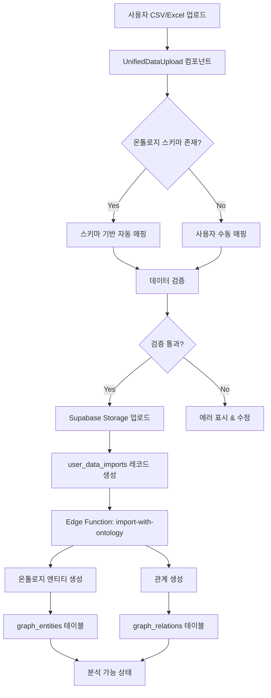
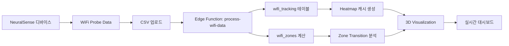
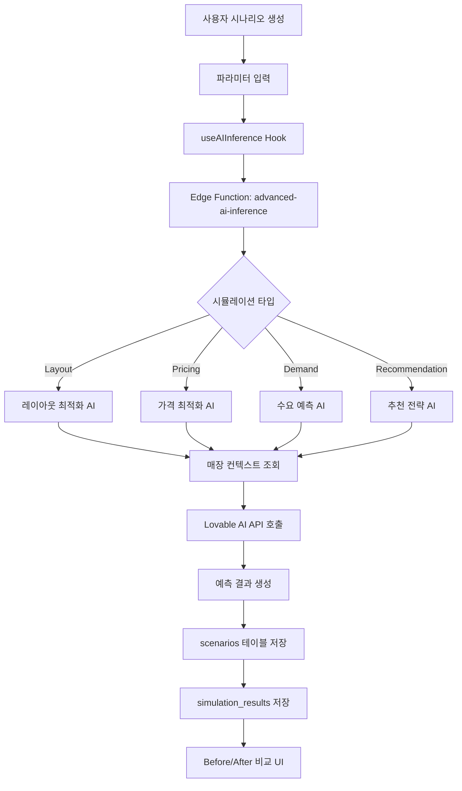
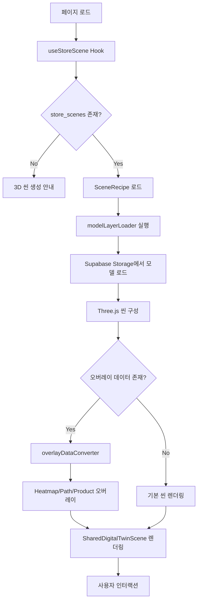
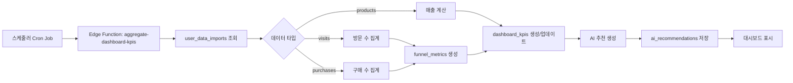
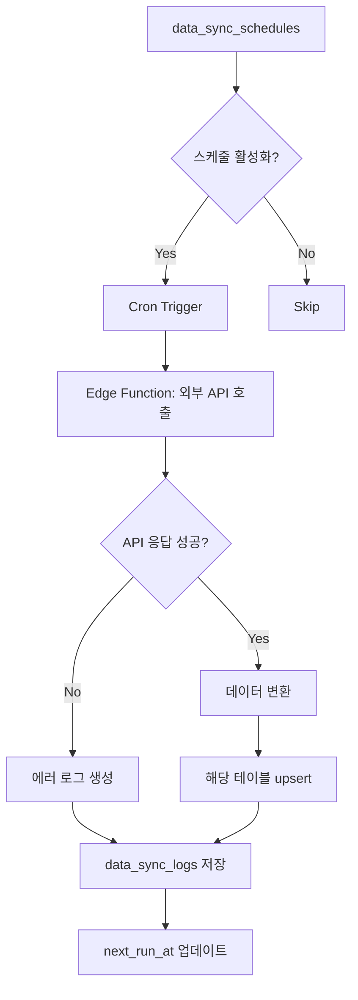

# NEURALTWIN 프로젝트 종합 아키텍처 문서

> **최종 업데이트**: 2025-11-21  
> **버전**: 2.0  
> **상태**: ✅ Production Ready

---

## 📑 목차

1. [프로젝트 개요](#프로젝트-개요)
2. [기술 스택](#기술-스택)
3. [프로젝트 구조](#프로젝트-구조)
4. [데이터베이스 아키텍처](#데이터베이스-아키텍처)
5. [데이터 흐름](#데이터-흐름)
6. [페이지 및 라우팅](#페이지-및-라우팅)
7. [주요 기능 모듈](#주요-기능-모듈)
8. [Supabase Edge Functions](#supabase-edge-functions)
9. [3D Digital Twin 시스템](#3d-digital-twin-시스템)
10. [Simulation 시스템](#simulation-시스템)
11. [인증 및 보안](#인증-및-보안)
12. [디자인 시스템](#디자인-시스템)
13. [배포 및 운영](#배포-및-운영)

---

## 프로젝트 개요

### 비전
NEURALTWIN은 AI 기반 리테일 데이터 분석 플랫폼으로, 매장의 디지털 트윈을 구축하고 다양한 시뮬레이션을 통해 최적의 의사결정을 지원합니다.

### 핵심 가치
- 🎯 **데이터 기반 의사결정**: 실시간 데이터 분석 및 AI 추천
- 🏬 **3D 디지털 트윈**: 매장의 3D 시각화 및 시뮬레이션
- 🤖 **AI 시뮬레이션**: 레이아웃, 가격, 재고, 수요 예측
- 📊 **통합 온톨로지**: 유연한 데이터 스키마 관리
- 🔄 **실시간 추적**: WiFi 기반 고객 동선 분석

### 주요 사용자
- 매장 관리자
- 본사 운영팀
- 데이터 분석가
- 머천다이저

---

## 기술 스택

### Frontend
```typescript
{
  "framework": "React 18.3.1",
  "language": "TypeScript 5.x",
  "routing": "React Router DOM 6.30.1",
  "state": "TanStack Query 5.83.0",
  "styling": "Tailwind CSS 3.x",
  "ui": "shadcn/ui",
  "3d": "Three.js + @react-three/fiber + @react-three/drei",
  "charts": "Recharts 2.15.4",
  "build": "Vite 5.x"
}
```

### Backend (Lovable Cloud)
```typescript
{
  "platform": "Lovable Cloud (Supabase)",
  "database": "PostgreSQL 15+",
  "auth": "Supabase Auth",
  "storage": "Supabase Storage",
  "realtime": "Supabase Realtime",
  "functions": "Supabase Edge Functions (Deno)",
  "ai": "Lovable AI (Gemini, GPT)"
}
```

### 주요 라이브러리
- **폼 관리**: react-hook-form + zod
- **데이터 처리**: xlsx, jspdf, date-fns
- **그래프**: react-force-graph-2d, d3-force
- **알림**: sonner
- **다크모드**: next-themes

---

## 프로젝트 구조

### 최상위 구조
```
NEURALTWIN/
├── src/                          # 소스 코드
│   ├── components/              # 공유 컴포넌트
│   ├── core/                    # 핵심 페이지
│   ├── features/                # Feature-based 모듈
│   ├── hooks/                   # 커스텀 훅
│   ├── integrations/            # 외부 통합
│   ├── lib/                     # 라이브러리 유틸리티
│   ├── types/                   # 공유 타입 정의
│   └── utils/                   # 유틸리티 함수
├── supabase/                    # Supabase 설정
│   ├── functions/               # Edge Functions
│   └── migrations/              # DB 마이그레이션
├── public/                      # 정적 파일
└── docs/                        # 문서
```

### Feature-based 아키텍처
```
src/features/
├── store-analysis/              # 매장 분석 (Tier 1)
│   ├── footfall/               # 고객 동선 분석
│   ├── customer/               # 고객 분석
│   ├── stores/                 # 매장 관리
│   └── inventory/              # 재고 관리
│
├── simulation/                  # AI 시뮬레이션 (Tier 2)
│   ├── components/             # 시뮬레이션 UI
│   ├── hooks/                  # 시뮬레이션 로직
│   ├── pages/                  # 시뮬레이션 페이지
│   └── types/                  # 시뮬레이션 타입
│
├── data-management/             # 데이터 관리 (Tier 1)
│   ├── import/                 # 데이터 임포트
│   ├── ontology/               # 온톨로지 스키마
│   ├── analysis/               # 데이터 분석
│   ├── bigdata/                # 외부 API 연동
│   └── neuralsense/            # WiFi 센서
│
├── digital-twin/                # 3D 디지털 트윈 (Tier 2)
│   ├── components/             # 3D 컴포넌트
│   │   ├── overlays/          # 데이터 오버레이
│   │   └── ...                # 씬 컴포저 등
│   ├── pages/                  # 3D 페이지
│   ├── utils/                  # 3D 유틸리티
│   └── types/                  # 3D 타입
│
├── cost-center/                 # 비용 센터 (Tier 3)
│   └── automation/             # 자동화 기능
│
└── profit-center/               # 수익 센터 (Tier 3)
    └── ...                     # (미래 확장)
```

---

## 데이터베이스 아키텍처

### Supabase 프로젝트
- **Project ID**: `olrpznsmzxbmkfppptgc`
- **Region**: Asia Pacific (Seoul)
- **PostgreSQL Version**: 15+

### 테이블 구조 (30+ 테이블)

#### 1. 매장 관리
```sql
-- stores: 매장 기본 정보
CREATE TABLE stores (
  id UUID PRIMARY KEY DEFAULT gen_random_uuid(),
  user_id UUID NOT NULL,
  store_name TEXT NOT NULL,
  store_code TEXT,
  address TEXT,
  area_sqm NUMERIC,
  created_at TIMESTAMPTZ DEFAULT now(),
  updated_at TIMESTAMPTZ DEFAULT now()
);

-- hq_store_master: 본사 매장 마스터
CREATE TABLE hq_store_master (
  id UUID PRIMARY KEY,
  user_id UUID NOT NULL,
  hq_store_code TEXT NOT NULL,
  hq_store_name TEXT NOT NULL,
  region TEXT,
  district TEXT,
  -- ... 추가 필드
);

-- store_mappings: 매장 매핑 관계
CREATE TABLE store_mappings (
  id UUID PRIMARY KEY,
  user_id UUID NOT NULL,
  local_store_id UUID REFERENCES stores(id),
  hq_store_id UUID REFERENCES hq_store_master(id),
  sync_enabled BOOLEAN DEFAULT true
);
```

#### 2. 데이터 임포트 & 온톨로지
```sql
-- user_data_imports: 사용자 데이터 업로드 이력
CREATE TABLE user_data_imports (
  id UUID PRIMARY KEY,
  user_id UUID NOT NULL,
  store_id UUID REFERENCES stores(id),
  data_type TEXT NOT NULL, -- 'customers', 'products', etc.
  file_path TEXT,
  row_count INTEGER,
  status TEXT DEFAULT 'pending',
  created_at TIMESTAMPTZ DEFAULT now()
);

-- ontology_entity_types: 엔티티 타입 정의
CREATE TABLE ontology_entity_types (
  id UUID PRIMARY KEY,
  user_id UUID NOT NULL,
  name TEXT NOT NULL,
  label TEXT NOT NULL,
  properties JSONB DEFAULT '[]',
  model_3d_url TEXT,
  -- ... 3D 메타데이터
);

-- ontology_relation_types: 관계 타입 정의
CREATE TABLE ontology_relation_types (
  id UUID PRIMARY KEY,
  user_id UUID NOT NULL,
  name TEXT NOT NULL,
  source_entity_type TEXT NOT NULL,
  target_entity_type TEXT NOT NULL,
  directionality TEXT DEFAULT 'directed'
);

-- graph_entities: 온톨로지 엔티티 인스턴스
CREATE TABLE graph_entities (
  id UUID PRIMARY KEY,
  user_id UUID NOT NULL,
  store_id UUID REFERENCES stores(id),
  entity_type_id UUID REFERENCES ontology_entity_types(id),
  label TEXT NOT NULL,
  properties JSONB DEFAULT '{}',
  model_3d_position JSONB,
  model_3d_rotation JSONB,
  model_3d_scale JSONB
);

-- graph_relations: 엔티티 간 관계
CREATE TABLE graph_relations (
  id UUID PRIMARY KEY,
  user_id UUID NOT NULL,
  source_entity_id UUID REFERENCES graph_entities(id),
  target_entity_id UUID REFERENCES graph_entities(id),
  relation_type_id UUID REFERENCES ontology_relation_types(id),
  weight FLOAT DEFAULT 1.0,
  properties JSONB
);
```

#### 3. WiFi 추적 & 센서
```sql
-- neuralsense_devices: WiFi 센서 디바이스
CREATE TABLE neuralsense_devices (
  id UUID PRIMARY KEY,
  user_id UUID NOT NULL,
  device_id TEXT NOT NULL,
  device_name TEXT NOT NULL,
  status TEXT DEFAULT 'offline',
  location TEXT,
  wifi_probe_enabled BOOLEAN DEFAULT true,
  last_seen TIMESTAMPTZ
);

-- wifi_tracking: WiFi 추적 데이터
CREATE TABLE wifi_tracking (
  id UUID PRIMARY KEY,
  user_id UUID NOT NULL,
  store_id UUID REFERENCES stores(id),
  device_mac TEXT,
  zone_id TEXT,
  timestamp TIMESTAMPTZ NOT NULL,
  signal_strength INTEGER,
  x_position NUMERIC,
  y_position NUMERIC,
  dwell_time_seconds INTEGER
);

-- wifi_zones: WiFi 존 정의
CREATE TABLE wifi_zones (
  id UUID PRIMARY KEY,
  user_id UUID NOT NULL,
  store_id UUID REFERENCES stores(id),
  zone_name TEXT NOT NULL,
  zone_type TEXT,
  boundary JSONB, -- GeoJSON polygon
  metadata JSONB
);
```

#### 4. 분석 & KPI
```sql
-- dashboard_kpis: 대시보드 KPI 집계
CREATE TABLE dashboard_kpis (
  id UUID PRIMARY KEY,
  user_id UUID NOT NULL,
  store_id UUID REFERENCES stores(id),
  date DATE NOT NULL,
  total_visits INTEGER DEFAULT 0,
  total_purchases INTEGER DEFAULT 0,
  total_revenue NUMERIC DEFAULT 0,
  conversion_rate NUMERIC DEFAULT 0,
  -- Funnel metrics
  funnel_entry INTEGER DEFAULT 0,
  funnel_browse INTEGER DEFAULT 0,
  funnel_fitting INTEGER DEFAULT 0,
  funnel_purchase INTEGER DEFAULT 0,
  -- External factors
  weather_condition TEXT,
  is_holiday BOOLEAN DEFAULT false,
  consumer_sentiment_index NUMERIC
);

-- funnel_metrics: 퍼널 상세 메트릭
CREATE TABLE funnel_metrics (
  id UUID PRIMARY KEY,
  user_id UUID NOT NULL,
  store_id UUID REFERENCES stores(id),
  date DATE NOT NULL,
  stage TEXT NOT NULL, -- 'entry', 'browse', 'fitting', 'purchase'
  count INTEGER NOT NULL,
  duration_seconds INTEGER,
  customer_segment TEXT
);

-- analysis_history: 분석 이력
CREATE TABLE analysis_history (
  id UUID PRIMARY KEY,
  user_id UUID NOT NULL,
  store_id UUID REFERENCES stores(id),
  analysis_type TEXT NOT NULL,
  input_data JSONB NOT NULL,
  result TEXT NOT NULL,
  created_at TIMESTAMPTZ DEFAULT now()
);
```

#### 5. AI & 시뮬레이션
```sql
-- scenarios: AI 시뮬레이션 시나리오
CREATE TABLE scenarios (
  id UUID PRIMARY KEY,
  user_id UUID NOT NULL,
  store_id UUID REFERENCES stores(id),
  scenario_type TEXT NOT NULL, -- 'layout', 'pricing', 'demand', 'recommendation'
  name TEXT NOT NULL,
  description TEXT,
  params JSONB DEFAULT '{}',
  baseline_kpi JSONB DEFAULT '{}',
  predicted_kpi JSONB DEFAULT '{}',
  confidence_score NUMERIC,
  ai_insights TEXT,
  status TEXT DEFAULT 'draft',
  created_at TIMESTAMPTZ DEFAULT now()
);

-- simulation_results: 시뮬레이션 결과
CREATE TABLE simulation_results (
  id UUID PRIMARY KEY,
  scenario_id UUID REFERENCES scenarios(id),
  result_type TEXT NOT NULL,
  result_data JSONB DEFAULT '{}',
  metadata JSONB
);

-- ai_recommendations: AI 추천
CREATE TABLE ai_recommendations (
  id UUID PRIMARY KEY,
  user_id UUID NOT NULL,
  store_id UUID REFERENCES stores(id),
  recommendation_type TEXT NOT NULL,
  title TEXT NOT NULL,
  description TEXT NOT NULL,
  priority TEXT NOT NULL, -- 'high', 'medium', 'low'
  evidence JSONB,
  expected_impact JSONB,
  status TEXT DEFAULT 'pending',
  is_displayed BOOLEAN DEFAULT true
);

-- ai_scene_analysis: 3D 씬 AI 분석
CREATE TABLE ai_scene_analysis (
  id UUID PRIMARY KEY,
  user_id UUID NOT NULL,
  store_id UUID REFERENCES stores(id),
  analysis_type TEXT NOT NULL,
  scene_data JSONB NOT NULL,
  insights JSONB NOT NULL,
  created_at TIMESTAMPTZ DEFAULT now()
);
```

#### 6. 재고 & 제품
```sql
-- products: 제품 정보
CREATE TABLE products (
  id UUID PRIMARY KEY,
  user_id UUID NOT NULL,
  sku TEXT NOT NULL,
  name TEXT NOT NULL,
  category TEXT,
  cost_price NUMERIC NOT NULL,
  selling_price NUMERIC NOT NULL,
  supplier TEXT,
  lead_time_days INTEGER DEFAULT 7
);

-- inventory_levels: 재고 수준
CREATE TABLE inventory_levels (
  id UUID PRIMARY KEY,
  user_id UUID NOT NULL,
  product_id UUID REFERENCES products(id),
  current_stock INTEGER DEFAULT 0,
  minimum_stock INTEGER NOT NULL,
  optimal_stock INTEGER NOT NULL,
  weekly_demand INTEGER DEFAULT 0,
  last_updated TIMESTAMPTZ DEFAULT now()
);

-- auto_order_suggestions: 자동 발주 제안
CREATE TABLE auto_order_suggestions (
  id UUID PRIMARY KEY,
  user_id UUID NOT NULL,
  product_id UUID REFERENCES products(id),
  current_stock INTEGER NOT NULL,
  optimal_stock INTEGER NOT NULL,
  suggested_order_quantity INTEGER NOT NULL,
  urgency_level TEXT NOT NULL,
  estimated_stockout_date TIMESTAMPTZ,
  potential_revenue_loss NUMERIC,
  status TEXT DEFAULT 'pending'
);
```

#### 7. 3D & 씬 관리
```sql
-- store_scenes: 3D 씬 레시피
CREATE TABLE store_scenes (
  id UUID PRIMARY KEY,
  user_id UUID NOT NULL,
  store_id UUID REFERENCES stores(id),
  name TEXT DEFAULT 'Default Scene',
  recipe_data JSONB NOT NULL, -- SceneRecipe
  is_active BOOLEAN DEFAULT true,
  created_at TIMESTAMPTZ DEFAULT now()
);
```

#### 8. 외부 데이터 & 동기화
```sql
-- external_data_sources: 외부 데이터 소스
CREATE TABLE external_data_sources (
  id UUID PRIMARY KEY,
  user_id UUID NOT NULL,
  source_type TEXT NOT NULL,
  name TEXT NOT NULL,
  api_url TEXT,
  api_key_encrypted TEXT,
  is_active BOOLEAN DEFAULT true
);

-- data_sync_schedules: 동기화 스케줄
CREATE TABLE data_sync_schedules (
  id UUID PRIMARY KEY,
  user_id UUID NOT NULL,
  data_source_id UUID REFERENCES external_data_sources(id),
  schedule_name TEXT NOT NULL,
  cron_expression TEXT NOT NULL,
  is_enabled BOOLEAN DEFAULT true,
  last_run_at TIMESTAMPTZ,
  next_run_at TIMESTAMPTZ
);

-- data_sync_logs: 동기화 로그
CREATE TABLE data_sync_logs (
  id UUID PRIMARY KEY,
  user_id UUID NOT NULL,
  schedule_id UUID REFERENCES data_sync_schedules(id),
  started_at TIMESTAMPTZ DEFAULT now(),
  completed_at TIMESTAMPTZ,
  status TEXT NOT NULL,
  records_synced INTEGER DEFAULT 0
);
```

#### 9. 외부 요인 데이터
```sql
-- holidays_events: 공휴일 및 이벤트
CREATE TABLE holidays_events (
  id UUID PRIMARY KEY,
  user_id UUID NOT NULL,
  store_id UUID REFERENCES stores(id),
  date DATE NOT NULL,
  event_name TEXT NOT NULL,
  event_type TEXT NOT NULL,
  impact_level TEXT
);

-- economic_indicators: 경제 지표
CREATE TABLE economic_indicators (
  id UUID PRIMARY KEY,
  user_id UUID NOT NULL,
  date DATE NOT NULL,
  indicator_type TEXT NOT NULL,
  indicator_value NUMERIC NOT NULL,
  region TEXT,
  source TEXT
);

-- regional_data: 지역 데이터
CREATE TABLE regional_data (
  id UUID PRIMARY KEY,
  user_id UUID NOT NULL,
  store_id UUID REFERENCES stores(id),
  date DATE NOT NULL,
  data_type TEXT NOT NULL,
  value NUMERIC NOT NULL,
  comparison_value NUMERIC
);
```

#### 10. 설정 & 관리
```sql
-- license_management: 라이선스 관리
CREATE TABLE license_management (
  id UUID PRIMARY KEY,
  user_id UUID NOT NULL,
  plan_type TEXT NOT NULL,
  max_stores INTEGER DEFAULT 1,
  max_hq_users INTEGER DEFAULT 1,
  api_calls_limit INTEGER DEFAULT 10000,
  storage_limit_gb INTEGER DEFAULT 5,
  is_active BOOLEAN DEFAULT true
);

-- organization_settings: 조직 설정
CREATE TABLE organization_settings (
  id UUID PRIMARY KEY,
  user_id UUID NOT NULL,
  currency TEXT DEFAULT 'KRW',
  timezone TEXT DEFAULT 'Asia/Seoul',
  brand_color TEXT DEFAULT '#1B6BFF',
  default_kpi_set JSONB
);

-- notification_settings: 알림 설정
CREATE TABLE notification_settings (
  id UUID PRIMARY KEY,
  user_id UUID NOT NULL,
  email_enabled BOOLEAN DEFAULT true,
  slack_enabled BOOLEAN DEFAULT false,
  slack_webhook_url TEXT,
  notification_types JSONB DEFAULT '["stockout", "anomaly", "milestone"]'
);

-- report_schedules: 리포트 스케줄
CREATE TABLE report_schedules (
  id UUID PRIMARY KEY,
  user_id UUID NOT NULL,
  report_type TEXT NOT NULL,
  report_name TEXT NOT NULL,
  frequency TEXT NOT NULL,
  recipients JSONB DEFAULT '[]',
  is_enabled BOOLEAN DEFAULT true
);
```

### RLS (Row Level Security) 정책

모든 테이블에 적용된 기본 RLS 정책:

```sql
-- SELECT: 자신의 데이터만 조회
CREATE POLICY "Users can view their own data"
ON table_name FOR SELECT
USING (auth.uid() = user_id);

-- INSERT: 자신의 user_id로만 생성
CREATE POLICY "Users can insert their own data"
ON table_name FOR INSERT
WITH CHECK (auth.uid() = user_id);

-- UPDATE: 자신의 데이터만 수정
CREATE POLICY "Users can update their own data"
ON table_name FOR UPDATE
USING (auth.uid() = user_id);

-- DELETE: 자신의 데이터만 삭제
CREATE POLICY "Users can delete their own data"
ON table_name FOR DELETE
USING (auth.uid() = user_id);
```

매장 관련 테이블 추가 정책:
```sql
-- store_id가 있는 테이블의 경우
CREATE POLICY "Users can access their store data"
ON table_name FOR ALL
USING (
  auth.uid() = user_id 
  AND (
    store_id IS NULL 
    OR EXISTS (
      SELECT 1 FROM stores 
      WHERE stores.id = table_name.store_id 
      AND stores.user_id = auth.uid()
    )
  )
);
```

### 데이터베이스 함수

```sql
-- 그래프 N-hop 쿼리
CREATE FUNCTION graph_n_hop_query(
  p_user_id UUID,
  p_start_entity_id UUID,
  p_max_hops INTEGER DEFAULT 3
) RETURNS JSONB;

-- 그래프 최단 경로
CREATE FUNCTION graph_shortest_path(
  p_user_id UUID,
  p_start_id UUID,
  p_end_id UUID
) RETURNS JSONB;

-- 권한 체크
CREATE FUNCTION has_role(_user_id UUID, _role app_role) 
RETURNS BOOLEAN;

CREATE FUNCTION is_admin(_user_id UUID) 
RETURNS BOOLEAN;
```

---

## 데이터 흐름

### 1. 데이터 임포트 흐름



### 2. WiFi 트래킹 데이터 흐름



### 3. AI 시뮬레이션 흐름



### 4. 3D 디지털 트윈 렌더링 흐름



### 5. 대시보드 KPI 집계 흐름



### 6. 외부 데이터 동기화 흐름



---

## 페이지 및 라우팅

### 라우팅 구조 (App.tsx)

```typescript
// 총 21개 라우트
<Routes>
  {/* Core Pages */}
  <Route path="/" element={<ProtectedRoute><DashboardPage /></ProtectedRoute>} />
  <Route path="/auth" element={<AuthPage />} />
  <Route path="/settings" element={<ProtectedRoute><SettingsPage /></ProtectedRoute>} />
  
  {/* Store Analysis (8개) */}
  <Route path="/stores" element={<ProtectedRoute><StoresPage /></ProtectedRoute>} />
  <Route path="/hq-store-sync" element={<ProtectedRoute><HQStoreSyncPage /></ProtectedRoute>} />
  <Route path="/footfall-analysis" element={<ProtectedRoute><FootfallAnalysisPage /></ProtectedRoute>} />
  <Route path="/traffic-heatmap" element={<ProtectedRoute><TrafficHeatmapPage /></ProtectedRoute>} />
  <Route path="/customer-journey" element={<ProtectedRoute><CustomerJourneyPage /></ProtectedRoute>} />
  <Route path="/conversion-funnel" element={<ProtectedRoute><ConversionFunnelPage /></ProtectedRoute>} />
  <Route path="/customer-analysis" element={<ProtectedRoute><CustomerAnalysisPage /></ProtectedRoute>} />
  <Route path="/inventory" element={<ProtectedRoute><InventoryPage /></ProtectedRoute>} />
  
  {/* Data Management (5개) */}
  <Route path="/data-import" element={<ProtectedRoute><UnifiedDataManagementPage /></ProtectedRoute>} />
  <Route path="/graph-analysis" element={<ProtectedRoute><GraphAnalysisPage /></ProtectedRoute>} />
  <Route path="/schema-builder" element={<ProtectedRoute><SchemaBuilderPage /></ProtectedRoute>} />
  <Route path="/analytics" element={<ProtectedRoute><AnalyticsPage /></ProtectedRoute>} />
  <Route path="/bigdata-api" element={<ProtectedRoute><BigDataAPIPage /></ProtectedRoute>} />
  
  {/* Simulation (5개) */}
  <Route path="/simulation/hub" element={<ProtectedRoute><SimulationHubPage /></ProtectedRoute>} />
  <Route path="/simulation/layout" element={<ProtectedRoute><LayoutSimPage /></ProtectedRoute>} />
  <Route path="/simulation/pricing" element={<ProtectedRoute><PricingSimPage /></ProtectedRoute>} />
  <Route path="/simulation/demand" element={<ProtectedRoute><DemandInventorySimPage /></ProtectedRoute>} />
  <Route path="/simulation/recommendation" element={<ProtectedRoute><RecommendationSimPage /></ProtectedRoute>} />
  
  {/* Digital Twin (1개) */}
  <Route path="/digital-twin/3d" element={<ProtectedRoute><DigitalTwin3DPage /></ProtectedRoute>} />
  
  {/* Cost Center (1개) */}
  <Route path="/product-performance" element={<ProtectedRoute><ProductPerformancePage /></ProtectedRoute>} />
  
  {/* 404 */}
  <Route path="*" element={<NotFoundPage />} />
</Routes>
```

### 사이드바 메뉴 구조 (AppSidebar.tsx)

```typescript
// 5개 섹션으로 구성
{
  "Store Analysis": {
    gradient: "purple",
    items: [
      "Footfall Analysis",
      "Traffic Heatmap",
      "Customer Journey",
      "Conversion Funnel",
      "Customer Analysis",
      "Store Management",
      "HQ Store Sync",
      "Inventory"
    ]
  },
  "Simulation & Optimization": {
    gradient: "cyan",
    items: [
      "Simulation Hub",
      "Layout Optimization",
      "Pricing Strategy",
      "Demand Forecasting",
      "Recommendation Engine"
    ]
  },
  "Data Management": {
    gradient: "blue",
    items: [
      "Unified Data Import",
      "Graph Analysis",
      "Schema Builder",
      "Analytics Dashboard",
      "BigData API"
    ]
  },
  "Digital Twin": {
    gradient: "teal",
    items: ["Digital Twin 3D"]
  },
  "Cost Center": {
    gradient: "red",
    items: ["Product Performance"]
  }
}
```

---

## 주요 기능 모듈

### 1. 통합 데이터 임포트 시스템

**위치**: `src/features/data-management/import/`

**주요 컴포넌트**:
- `UnifiedDataUpload`: CSV/Excel 파일 업로드
- `SchemaMapper`: 스키마 매핑 UI
- `DataValidation`: 데이터 검증
- `OntologyDataManagement`: 온톨로지 기반 데이터 관리

**지원 데이터 타입**:
1. `customers` - 고객 정보
2. `products` - 제품 정보
3. `purchases` - 구매 이력
4. `visits` - 방문 이력
5. `staff` - 직원 정보
6. `wifi_tracking` - WiFi 추적 데이터
7. `inventory` - 재고 데이터
8. `sales` - 판매 데이터
9. `footfall` - 유동인구 데이터

**흐름**:
```typescript
// 1. 파일 업로드
const handleFileUpload = async (file: File) => {
  const parsedData = await parseCSV(file);
  
  // 2. 스키마 매핑
  const mapping = await mapToOntology(parsedData, schemaType);
  
  // 3. 검증
  const validation = validateData(parsedData, mapping);
  
  // 4. Storage 업로드
  const { data: upload } = await supabase.storage
    .from('store-data')
    .upload(filePath, file);
  
  // 5. 메타데이터 저장
  await supabase.from('user_data_imports').insert({
    user_id,
    store_id,
    data_type,
    file_path: upload.path,
    row_count: parsedData.length
  });
  
  // 6. Edge Function 트리거
  await supabase.functions.invoke('import-with-ontology', {
    body: { importId, mapping }
  });
};
```

### 2. 온톨로지 스키마 시스템

**위치**: `src/features/data-management/ontology/`

**핵심 개념**:
- **Entity Type**: 엔티티 타입 정의 (Customer, Product, Zone 등)
- **Relation Type**: 관계 타입 정의 (PURCHASED, VISITED 등)
- **Entity**: 실제 엔티티 인스턴스
- **Relation**: 엔티티 간 관계 인스턴스

**예시 스키마**:
```json
{
  "entityTypes": [
    {
      "name": "Customer",
      "properties": [
        {"name": "age", "type": "number"},
        {"name": "gender", "type": "string"},
        {"name": "segment", "type": "string"}
      ]
    },
    {
      "name": "Product",
      "properties": [
        {"name": "sku", "type": "string"},
        {"name": "price", "type": "number"},
        {"name": "category", "type": "string"}
      ]
    }
  ],
  "relationTypes": [
    {
      "name": "PURCHASED",
      "source": "Customer",
      "target": "Product",
      "properties": [
        {"name": "quantity", "type": "number"},
        {"name": "timestamp", "type": "datetime"}
      ]
    }
  ]
}
```

**그래프 쿼리**:
```typescript
// N-hop 쿼리
const { data } = await supabase.rpc('graph_n_hop_query', {
  p_user_id: userId,
  p_start_entity_id: customerId,
  p_max_hops: 2
});

// 최단 경로 쿼리
const { data } = await supabase.rpc('graph_shortest_path', {
  p_user_id: userId,
  p_start_id: entityA,
  p_end_id: entityB
});
```

### 3. WiFi 추적 시스템

**위치**: `src/features/data-management/neuralsense/`

**컴포넌트**:
- `DeviceRegistrationForm`: 디바이스 등록
- `DeviceList`: 디바이스 목록
- `WiFiDataUploader`: WiFi 데이터 업로드

**CSV 형식**:
```csv
device_mac,timestamp,zone_id,signal_strength,x_position,y_position
AA:BB:CC:DD:EE:FF,2024-01-15T10:30:00Z,entrance,75,12.5,8.3
AA:BB:CC:DD:EE:FF,2024-01-15T10:31:00Z,clothing,68,25.0,15.2
```

**처리 프로세스**:
```typescript
// Edge Function: process-wifi-data
export default async (req: Request) => {
  const { importId } = await req.json();
  
  // 1. CSV 파싱
  const csvData = await loadFromStorage(importId);
  
  // 2. Zone 매칭
  const enrichedData = csvData.map(row => ({
    ...row,
    zone_id: findZoneByPosition(row.x_position, row.y_position)
  }));
  
  // 3. Dwell Time 계산
  const withDwellTime = calculateDwellTime(enrichedData);
  
  // 4. DB 저장
  await supabase.from('wifi_tracking').insert(withDwellTime);
  
  // 5. Heatmap 캐시 생성
  await generateHeatmapCache(withDwellTime);
};
```

### 4. 고객 분석 시스템

**위치**: `src/features/store-analysis/customer/`

**분석 항목**:
1. **세그멘테이션**: RFM, 구매패턴, 인구통계
2. **구매 패턴**: 시간대별, 요일별, 카테고리별
3. **Lifetime Value**: 고객 생애 가치 예측
4. **Churn 예측**: 이탈 가능성 분석

**Hooks**:
```typescript
// useCustomerSegments
const { data: segments } = useCustomerSegments(storeId);
// 반환: {vip: 15, regular: 120, new: 45, churned: 30}

// usePurchasePatterns
const { data: patterns } = usePurchasePatterns(storeId);
// 반환: 시간대별/요일별 구매 패턴
```

### 5. Conversion Funnel 시스템

**위치**: `src/features/store-analysis/footfall/`

**퍼널 단계**:
1. **Entry** (입구 통과)
2. **Browse** (상품 둘러보기)
3. **Fitting** (피팅룸 사용)
4. **Purchase** (구매)
5. **Return** (재방문)

**시각화**:
```typescript
<FunnelVisualization data={funnelData} />
// 각 단계별 수치, 전환율, 드롭오프율 표시
```

---

## Supabase Edge Functions

### 1. advanced-ai-inference

**목적**: AI 기반 시뮬레이션 및 예측

**엔드포인트**: `/functions/v1/advanced-ai-inference`

**지원 기능**:
- 레이아웃 최적화
- 가격 최적화
- 수요 예측
- 재고 최적화
- 추천 전략

**요청 예시**:
```typescript
const { data } = await supabase.functions.invoke('advanced-ai-inference', {
  body: {
    type: 'demand_forecast',
    store_id: storeId,
    params: {
      product_id: 'PROD123',
      forecast_period_days: 30,
      include_seasonality: true
    }
  }
});
```

**응답 형식**:
```typescript
{
  success: true,
  prediction: {
    type: 'demand_forecast',
    confidence: 0.87,
    demandDrivers: {
      primary: ['seasonality', 'promotion'],
      secondary: ['weather', 'competition']
    },
    forecast: [
      { date: '2024-01-15', predicted_demand: 125, confidence: 0.9 },
      // ...
    ],
    insights: "Peak demand expected during holiday season..."
  }
}
```

### 2. import-with-ontology

**목적**: 온톨로지 기반 데이터 임포트

**프로세스**:
1. Storage에서 CSV 로드
2. 스키마 매핑 적용
3. Entity 생성
4. Relation 생성
5. 검증 및 에러 처리

### 3. process-wifi-data

**목적**: WiFi 추적 데이터 처리

**기능**:
- Zone 자동 매칭
- Dwell Time 계산
- Heatmap 캐시 생성
- 이상 패턴 감지

### 4. aggregate-dashboard-kpis

**목적**: 대시보드 KPI 자동 집계

**스케줄**: 매일 자정 (Cron)

**집계 항목**:
- 총 방문 수
- 총 구매 수
- 총 매출
- 전환율
- 퍼널 메트릭
- 고객 세그먼트별 통계

### 5. generate-ai-recommendations

**목적**: AI 기반 추천 자동 생성

**추천 타입**:
1. **재고 경고**: 품절 위험 상품
2. **가격 조정**: 가격 최적화 제안
3. **레이아웃**: 동선 개선 제안
4. **프로모션**: 타겟 프로모션 제안
5. **인력 배치**: 시간대별 인력 조정

**예시**:
```typescript
{
  title: "프리미엄 청바지 재고 부족 경고",
  description: "현재 재고 15개, 3일 내 품절 예상",
  priority: "high",
  evidence: {
    current_stock: 15,
    daily_demand: 5.2,
    estimated_stockout_date: "2024-01-18"
  },
  expected_impact: {
    potential_revenue_loss: 1250000
  }
}
```

### 6. sync-hq-stores

**목적**: 본사 매장 마스터 동기화

**기능**:
- 외부 시스템에서 매장 정보 가져오기
- hq_store_master 업데이트
- store_mappings 자동 생성

### 7. analyze-store-data

**목적**: 매장 데이터 종합 분석

**분석 항목**:
- 매출 트렌드
- 고객 행동 패턴
- 재고 회전율
- 인력 효율성

---

## 3D Digital Twin 시스템

### 아키텍처

**핵심 컴포넌트**:
1. **SceneComposer**: 3D 씬 구성 인터페이스
2. **SceneViewer**: 씬 렌더링 뷰어
3. **Store3DViewer**: 매장 전용 3D 뷰어
4. **SharedDigitalTwinScene**: 공유 씬 컴포넌트

**데이터 구조**:
```typescript
// SceneRecipe
interface SceneRecipe {
  version: string;
  storeId: string;
  layers: {
    base?: ModelLayer;       // 건물/벽
    furniture?: ModelLayer;  // 가구/집기
    products?: ModelLayer;   // 상품 디스플레이
  };
  lighting: {
    presetName: string;
    ambient: {intensity: number; color: string};
    directional: {intensity: number; position: [x,y,z]};
  };
  camera: {
    position: [x, y, z];
    target: [x, y, z];
  };
}

// ModelLayer
interface ModelLayer {
  instances: Array<{
    id: string;
    modelUrl: string;
    position: [x, y, z];
    rotation: [x, y, z];
    scale: [x, y, z];
    metadata?: Record<string, any>;
  }>;
}
```

**씬 저장 프로세스**:
```typescript
// 1. 씬 구성
const recipe: SceneRecipe = {
  version: "1.0",
  storeId: selectedStore.id,
  layers: {
    base: { instances: [...] },
    furniture: { instances: [...] },
    products: { instances: [...] }
  },
  lighting: lightingPreset,
  camera: currentCameraState
};

// 2. 검증
const isValid = validateSceneRecipe(recipe);

// 3. 저장
await supabase.from('store_scenes').upsert({
  user_id: userId,
  store_id: storeId,
  recipe_data: recipe,
  is_active: true
});
```

**씬 로딩 프로세스**:
```typescript
// 1. 씬 조회
const { data: scene } = await supabase
  .from('store_scenes')
  .select('*')
  .eq('store_id', storeId)
  .eq('is_active', true)
  .single();

// 2. 레시피 파싱
const recipe: SceneRecipe = scene.recipe_data;

// 3. 모델 로드
const loadedLayers = await modelLayerLoader.loadAllLayers(recipe.layers);

// 4. Three.js 씬 구성
<Canvas>
  <ambientLight intensity={recipe.lighting.ambient.intensity} />
  {loadedLayers.map(instance => (
    <mesh key={instance.id} position={instance.position}>
      <primitive object={instance.model} />
    </mesh>
  ))}
</Canvas>
```

### 오버레이 시스템

**지원 오버레이**:
1. **HeatmapOverlay3D**: WiFi 히트맵
2. **CustomerPathOverlay**: 고객 동선
3. **ProductInfoOverlay**: 상품 정보 마커
4. **ZoneBoundaryOverlay**: 존 경계선
5. **DwellTimeOverlay**: 체류 시간 시각화

**데이터 변환**:
```typescript
// overlayDataConverter.ts
export const generateHeatPoints = (wifiData: WiFiTracking[]): HeatPoint[] => {
  const grid = createGrid(wifiData);
  return grid.map(cell => ({
    x: cell.x,
    z: cell.z,
    intensity: cell.count / maxCount // 0-1 정규화
  }));
};

export const generateCustomerPaths = (visits: Visit[]): PathPoint[][] => {
  return visits.map(visit => 
    visit.trajectory.map(point => ({
      x: point.x,
      y: 0.1, // 바닥에서 살짝 위
      z: point.z,
      timestamp: point.timestamp
    }))
  );
};
```

**사용 예시**:
```typescript
<Store3DViewer
  storeId={storeId}
  overlay={
    <HeatmapOverlay3D 
      heatPoints={heatPoints}
      colorScale={['blue', 'green', 'yellow', 'red']}
    />
  }
/>
```

### 모델 파일 명명 규칙

**형식**: `{ENTITY_TYPE}_{LABEL}_{UUID}.glb`

**예시**:
- `Product_TShirt_a1b2c3d4.glb`
- `Furniture_Rack_e5f6g7h8.glb`
- `Zone_Entrance_i9j0k1l2.glb`

**파서**:
```typescript
// modelFilenameParser.ts
export const parseModelFilename = (filename: string) => {
  const parts = filename.split('_');
  return {
    entityType: parts[0],
    label: parts[1],
    uuid: parts[2].replace('.glb', '')
  };
};
```

---

## Simulation 시스템

### 시뮬레이션 타입

#### 1. Layout Simulation (레이아웃 최적화)

**목적**: 매장 레이아웃 변경에 따른 효과 예측

**파라미터**:
```typescript
interface LayoutParams {
  zone_changes: Array<{
    zone_id: string;
    new_area_sqm: number;
    new_position: {x: number; y: number};
  }>;
  fixture_changes: Array<{
    fixture_id: string;
    action: 'add' | 'remove' | 'move';
    position?: {x: number; y: number; z: number};
  }>;
  target_kpi: 'sales' | 'traffic' | 'conversion';
}
```

**예측 결과**:
```typescript
{
  baseline_kpi: {
    daily_revenue: 5000000,
    daily_traffic: 450,
    conversion_rate: 0.12
  },
  predicted_kpi: {
    daily_revenue: 5750000, // +15%
    daily_traffic: 520,     // +16%
    conversion_rate: 0.13   // +8%
  },
  confidence: 0.82,
  insights: "Moving premium products to entrance zone increases visibility..."
}
```

#### 2. Pricing Simulation (가격 최적화)

**목적**: 가격 변경에 따른 매출 및 수요 예측

**파라미터**:
```typescript
interface PricingParams {
  product_ids: string[];
  price_changes: Array<{
    product_id: string;
    current_price: number;
    new_price: number;
    price_change_percent: number;
  }>;
  strategy: 'maximize_revenue' | 'maximize_volume' | 'market_penetration';
  competitor_prices?: Record<string, number>;
}
```

**예측**:
```typescript
{
  pricingAnalysis: {
    elasticity: -1.8,
    optimal_price: 45000,
    expected_demand_change: -12,
    expected_revenue_change: +8.5
  },
  recommendations: [
    {
      product_id: 'PROD123',
      action: 'decrease',
      from: 50000,
      to: 45000,
      rationale: "High price elasticity, volume gain outweighs margin loss"
    }
  ]
}
```

#### 3. Demand Forecast (수요 예측)

**목적**: 미래 수요 예측

**파라미터**:
```typescript
interface DemandParams {
  product_id: string;
  forecast_period_days: number;
  include_seasonality: boolean;
  include_promotions: boolean;
  include_external_factors: boolean; // 날씨, 경제지표 등
}
```

**예측**:
```typescript
{
  demandDrivers: {
    primary: ['seasonality', 'trend'],
    secondary: ['weather', 'promotion']
  },
  forecast: [
    {
      date: '2024-01-15',
      predicted_demand: 125,
      lower_bound: 110,
      upper_bound: 140,
      confidence: 0.85
    },
    // ... 30일치 예측
  ],
  total_forecasted_demand: 3500,
  insights: "Strong upward trend due to upcoming holiday season..."
}
```

#### 4. Inventory Optimization (재고 최적화)

**목적**: 최적 재고 수준 계산

**파라미터**:
```typescript
interface InventoryParams {
  product_id: string;
  current_stock: number;
  lead_time_days: number;
  service_level: number; // 0.95 = 95% 서비스 수준
  holding_cost_percent: number;
  stockout_cost_per_unit: number;
}
```

**결과**:
```typescript
{
  optimizationResults: {
    reorder_point: 85,
    economic_order_quantity: 200,
    safety_stock: 35,
    optimal_stock_level: 120,
    expected_stockout_risk: 0.05,
    annual_holding_cost: 450000,
    expected_stockout_cost: 125000
  },
  recommendations: [
    {
      action: 'order',
      quantity: 150,
      urgency: 'high',
      expected_stockout_date: '2024-01-18'
    }
  ]
}
```

#### 5. Recommendation Strategy (추천 전략)

**목적**: 개인화 추천 전략 시뮬레이션

**파라미터**:
```typescript
interface RecommendationParams {
  strategy_type: 'collaborative' | 'content_based' | 'hybrid';
  target_segment: 'vip' | 'regular' | 'new' | 'all';
  recommendation_count: number;
  diversity_weight: number; // 0-1, 다양성 vs 정확도 트레이드오프
}
```

**결과**:
```typescript
{
  strategyDetails: {
    algorithm: 'hybrid_collaborative_filtering',
    target_conversion_lift: 0.15,
    expected_aov_increase: 12000
  },
  sample_recommendations: [
    {
      customer_segment: 'vip',
      recommended_products: ['PROD456', 'PROD789'],
      expected_conversion_rate: 0.28
    }
  ],
  ab_test_suggestion: {
    control: 'random_recommendations',
    variant: 'ai_personalized',
    recommended_duration_days: 14
  }
}
```

### Hooks

```typescript
// useAIInference: AI 추론 실행
const { mutate: runInference, isLoading } = useAIInference();

// useScenarioManager: 시나리오 관리
const { 
  scenarios, 
  createScenario, 
  updateScenario, 
  deleteScenario 
} = useScenarioManager(storeId);

// useKpiComparison: KPI 비교
const comparison = useKpiComparison(baselineKpi, predictedKpi);

// useStoreContext: 매장 컨텍스트 조회
const storeContext = useStoreContext(storeId);
```

### Before/After 비교 UI

```typescript
<BeforeAfterComparison
  baseline={{
    revenue: 5000000,
    traffic: 450,
    conversion: 0.12
  }}
  predicted={{
    revenue: 5750000,
    traffic: 520,
    conversion: 0.13
  }}
  confidence={0.82}
/>
```

---

## 인증 및 보안

### 인증 흐름

```typescript
// 1. 회원가입
const { data, error } = await supabase.auth.signUp({
  email: 'user@example.com',
  password: 'password123',
  options: {
    emailRedirectTo: `${window.location.origin}/auth/callback`
  }
});

// 2. 로그인
const { data, error } = await supabase.auth.signInWithPassword({
  email: 'user@example.com',
  password: 'password123'
});

// 3. 세션 확인
const { data: { session } } = await supabase.auth.getSession();

// 4. 로그아웃
await supabase.auth.signOut();
```

### ProtectedRoute 컴포넌트

```typescript
const ProtectedRoute = ({ children }: { children: React.ReactNode }) => {
  const { session, isLoading } = useAuth();
  
  if (isLoading) return <LoadingSpinner />;
  
  if (!session) {
    return <Navigate to="/auth" replace />;
  }
  
  return <>{children}</>;
};
```

### RLS 정책 예시

```sql
-- 모든 테이블에 적용된 기본 정책
CREATE POLICY "Users can only access their own data"
ON table_name
FOR ALL
USING (auth.uid() = user_id);

-- 매장별 접근 제어
CREATE POLICY "Users can access their stores"
ON graph_entities
FOR ALL
USING (
  auth.uid() = user_id 
  AND (
    store_id IS NULL 
    OR EXISTS (
      SELECT 1 FROM stores 
      WHERE stores.id = graph_entities.store_id 
      AND stores.user_id = auth.uid()
    )
  )
);
```

### 데이터 암호화

- **전송 중**: HTTPS/TLS 1.3
- **저장 시**: Supabase 자동 암호화 (AES-256)
- **API 키**: Supabase Vault 사용

---

## 디자인 시스템

### 색상 팔레트 (HSL)

```css
/* index.css */
:root {
  /* Primary Colors */
  --primary: 220 100% 55%;      /* Electric Blue #1B6BFF */
  --primary-foreground: 0 0% 100%;
  
  /* Background */
  --background: 222 47% 6%;     /* Dark Navy #0A1020 */
  --foreground: 210 40% 98%;
  
  /* Accent Colors */
  --accent: 220 90% 60%;
  --accent-foreground: 0 0% 100%;
  
  /* Muted */
  --muted: 217 33% 17%;
  --muted-foreground: 215 20% 65%;
  
  /* Card */
  --card: 222 47% 8%;
  --card-foreground: 210 40% 98%;
  
  /* Border */
  --border: 217 33% 20%;
  
  /* Section Gradients */
  --gradient-purple: linear-gradient(135deg, hsl(270, 70%, 60%), hsl(290, 70%, 50%));
  --gradient-cyan: linear-gradient(135deg, hsl(180, 70%, 50%), hsl(200, 80%, 60%));
  --gradient-blue: linear-gradient(135deg, hsl(220, 80%, 55%), hsl(240, 75%, 60%));
  --gradient-green: linear-gradient(135deg, hsl(140, 60%, 50%), hsl(160, 65%, 45%));
  --gradient-red: linear-gradient(135deg, hsl(0, 70%, 55%), hsl(15, 75%, 50%));
}
```

### 타이포그래피

```css
/* 한글: Pretendard */
@import url('https://cdn.jsdelivr.net/gh/orioncactus/pretendard/dist/web/static/pretendard.css');

/* 영문: Inter */
@import url('https://fonts.googleapis.com/css2?family=Inter:wght@400;500;600;700&display=swap');

body {
  font-family: 'Pretendard', 'Inter', sans-serif;
}
```

### 컴포넌트 변형

```typescript
// Button 변형
const buttonVariants = cva(
  "inline-flex items-center justify-center rounded-md text-sm font-medium transition-colors",
  {
    variants: {
      variant: {
        default: "bg-primary text-primary-foreground hover:bg-primary/90",
        destructive: "bg-destructive text-destructive-foreground hover:bg-destructive/90",
        outline: "border border-input bg-background hover:bg-accent hover:text-accent-foreground",
        secondary: "bg-secondary text-secondary-foreground hover:bg-secondary/80",
        ghost: "hover:bg-accent hover:text-accent-foreground",
        link: "text-primary underline-offset-4 hover:underline"
      },
      size: {
        default: "h-10 px-4 py-2",
        sm: "h-9 rounded-md px-3",
        lg: "h-11 rounded-md px-8",
        icon: "h-10 w-10"
      }
    }
  }
);
```

### Glassmorphism 효과

```css
.glass-effect {
  background: rgba(255, 255, 255, 0.05);
  backdrop-filter: blur(10px);
  border: 1px solid rgba(255, 255, 255, 0.1);
  box-shadow: 0 8px 32px 0 rgba(0, 0, 0, 0.37);
}
```

---

## 배포 및 운영

### 환경 변수

```bash
# .env (자동 생성, 수정 금지)
VITE_SUPABASE_URL=https://olrpznsmzxbmkfppptgc.supabase.co
VITE_SUPABASE_PUBLISHABLE_KEY=eyJhbGciOiJIUzI1NiIsInR5cCI6IkpXVCJ9...
VITE_SUPABASE_PROJECT_ID=olrpznsmzxbmkfppptgc
```

### 빌드 & 배포

```bash
# 개발 서버
npm run dev

# 프로덕션 빌드
npm run build

# 프리뷰
npm run preview
```

### Edge Functions 배포

```bash
# 자동 배포 (코드 변경 시)
# Lovable Cloud가 자동으로 감지하여 배포

# 수동 배포 (필요시)
supabase functions deploy function-name
```

### 모니터링

**주요 지표**:
- API 호출 횟수
- 응답 시간
- 에러율
- Storage 사용량
- Database 연결 수

**로그 확인**:
```typescript
// Edge Function 로그
await supabase.functions.invoke('function-name', {
  body: { ... }
});
// 로그는 Supabase Dashboard에서 확인
```

### 백업 전략

1. **데이터베이스**: Supabase 자동 백업 (매일)
2. **Storage**: 중요 파일은 별도 백업
3. **코드**: Git 버전 관리

---

## 부록

### A. 주요 타입 정의

```typescript
// analysis.types.ts
export interface TrafficData {
  hour: number;
  count: number;
  zone: string;
}

export interface HeatPoint {
  x: number;
  z: number;
  intensity: number; // 0-1
}

export interface PathPoint {
  x: number;
  y: number;
  z: number;
  timestamp?: number;
}

// scene3d.ts
export interface SceneRecipe {
  version: string;
  storeId: string;
  layers: {
    base?: ModelLayer;
    furniture?: ModelLayer;
    products?: ModelLayer;
  };
  lighting: LightingPreset;
  camera: CameraState;
}

export interface ModelInstance {
  id: string;
  modelUrl: string;
  position: [number, number, number];
  rotation: [number, number, number];
  scale: [number, number, number];
  metadata?: Record<string, any>;
}

// prediction.types.ts
export interface PredictionResult {
  type: string;
  confidence: number;
  demandDrivers?: {
    primary: string[];
    secondary: string[];
  };
  optimizationResults?: {
    reorder_point: number;
    economic_order_quantity: number;
    safety_stock: number;
  };
  pricingAnalysis?: {
    elasticity: number;
    optimal_price: number;
    expected_demand_change: number;
  };
  strategyDetails?: {
    algorithm: string;
    target_conversion_lift: number;
  };
}
```

### B. 주요 유틸리티 함수

```typescript
// coordinateMapper.ts
export const worldToScreen = (
  worldPos: [number, number, number],
  camera: THREE.Camera
): [number, number] => {
  const vector = new THREE.Vector3(...worldPos);
  vector.project(camera);
  const x = (vector.x + 1) / 2 * window.innerWidth;
  const y = -(vector.y - 1) / 2 * window.innerHeight;
  return [x, y];
};

// dataNormalizer.ts
export const normalizeCustomerData = (raw: any[]): Customer[] => {
  return raw.map(row => ({
    id: row.customer_id || generateId(),
    age: parseInt(row.age) || 0,
    gender: row.gender || 'unknown',
    segment: classifySegment(row),
    lifetime_value: calculateLTV(row)
  }));
};

// overlayDataConverter.ts
export const generateHeatPoints = (
  wifiData: WiFiTracking[]
): HeatPoint[] => {
  const grid = createGrid(wifiData, {cellSize: 1});
  return grid.map(cell => ({
    x: cell.x,
    z: cell.z,
    intensity: cell.count / grid.maxCount
  }));
};
```

### C. Feature Flags

```typescript
// featureFlags.ts
export const FEATURE_FLAGS = {
  // Tier 1 (무료)
  BASIC_FOOTFALL_ANALYSIS: true,
  BASIC_HEATMAP: true,
  BASIC_CUSTOMER_JOURNEY: true,
  DATA_IMPORT: true,
  STORE_MANAGEMENT: true,
  
  // Tier 2 (프로)
  ADVANCED_ANALYTICS: false,
  AI_SIMULATION: false,
  DIGITAL_TWIN_3D: false,
  REAL_TIME_TRACKING: false,
  
  // Tier 3 (엔터프라이즈)
  MULTI_STORE_SYNC: false,
  CUSTOM_ONTOLOGY: false,
  API_ACCESS: false,
  WHITE_LABEL: false
};
```

### D. 성능 최적화

**React 최적화**:
```typescript
// useMemo로 불필요한 재계산 방지
const heatPoints = useMemo(() => 
  generateHeatPoints(wifiData),
  [wifiData]
);

// React.memo로 불필요한 리렌더 방지
export const StatCard = React.memo(({ title, value, icon }: Props) => {
  // ...
});

// 동적 import로 코드 스플리팅
const DigitalTwin3DPage = lazy(() => 
  import('@/features/digital-twin/pages/DigitalTwin3DPage')
);
```

**Three.js 최적화**:
```typescript
// LOD (Level of Detail) 적용
<Lod>
  <mesh geometry={highPolyGeo} material={mat} />
  <mesh geometry={medPolyGeo} material={mat} />
  <mesh geometry={lowPolyGeo} material={mat} />
</Lod>

// Instanced Mesh로 동일 모델 대량 렌더링
<Instances limit={1000} geometry={boxGeo} material={mat}>
  {products.map(p => (
    <Instance key={p.id} position={p.position} />
  ))}
</Instances>
```

**데이터베이스 최적화**:
```sql
-- 인덱스 생성
CREATE INDEX idx_wifi_tracking_store_timestamp 
ON wifi_tracking(store_id, timestamp DESC);

CREATE INDEX idx_graph_entities_store_type 
ON graph_entities(store_id, entity_type_id);

-- 파티셔닝 (대용량 데이터)
CREATE TABLE wifi_tracking_2024_01 PARTITION OF wifi_tracking
FOR VALUES FROM ('2024-01-01') TO ('2024-02-01');
```

---

## 참고 문서

- [CURRENT_PROJECT_ARCHITECTURE.md](./CURRENT_PROJECT_ARCHITECTURE.md)
- [CODE_ORGANIZATION_SUMMARY.md](./CODE_ORGANIZATION_SUMMARY.md)
- [DIGITAL_TWIN_3D_INTEGRATION.md](./DIGITAL_TWIN_3D_INTEGRATION.md)
- [REFACTORING_COMPLETE.md](./REFACTORING_COMPLETE.md)
- [docs/DATA_MANAGEMENT_GUIDE.md](./docs/DATA_MANAGEMENT_GUIDE.md)
- [docs/IOT_TRACKING_INTEGRATION.md](./docs/IOT_TRACKING_INTEGRATION.md)

---

**문서 작성일**: 2025-11-21  
**작성자**: NEURALTWIN Development Team  
**문서 버전**: 2.0  
**상태**: ✅ 완료  
**다음 업데이트 예정**: 주요 기능 변경 시
