# NEURALTWIN 제안 IA 아키텍처

## 📋 개요

이 문서는 NEURALTWIN의 새로운 4-Tier IA 구조를 정의합니다.
기존 기능 중심 분류에서 **사용자 워크플로우 중심**으로 재구성합니다.

**핵심 철학**: Overview → Analysis → Simulation → Data Management
- **Overview**: 현재 상태 파악
- **Analysis**: 문제점 발견
- **Simulation**: 해결책 실험
- **Data Management**: 데이터 인프라 관리

---

## 🗂️ 전체 IA 구조

```
NEURALTWIN APP
├─ 1. Overview (4 pages)
├─ 2. Analysis (8 pages)
├─ 3. Simulation (6 pages)
└─ 4. Data Management (5 pages)

총 23개 페이지
```

---

## 🔄 섹션별 데이터 처리 로직

### 1️⃣ Overview & 2️⃣ Analysis
**데이터 흐름**: 임포트 데이터 → 통계 분석 → 시각화

```mermaid
graph LR
    A[임포트된 데이터] --> B[데이터 집계/분석]
    B --> C[통계 계산]
    C --> D[차트/테이블 렌더링]
```



**특징**:
- ✅ 실제 업로드된 데이터 기반
- ✅ SQL 쿼리 및 통계 연산
- ✅ 실시간 대시보드
- ❌ AI 추론 불필요 (단순 집계)

**데이터 소스**:
- `user_data_imports` (업로드 데이터)
- `wifi_tracking` (WiFi 트래킹)
- `stores` (매장 마스터)
- `graph_entities` / `graph_relations` (온톨로지 데이터)

**주요 기술**:
- TanStack Query (데이터 페칭)
- Recharts (시각화)
- Supabase Select (읽기)

---

### 3️⃣ Simulation
**데이터 흐름**: 임포트 데이터 + 온톨로지 스키마 → AI 고급추론 → What-if 예측

```mermaid
graph LR
    A[임포트된 데이터] --> D[AI 추론 엔진]
    B[온톨로지 스키마] --> D
    C[시뮬레이션 파라미터] --> D
    D --> E[AI 예측 결과]
    E --> F[KPI 변화량 시각화]
```



**특징**:
- ✅ AI 고급 추론 필요
- ✅ 온톨로지 그래프 기반 컨텍스트
- ✅ What-if 시나리오 생성
- ✅ 미래 예측 (ΔCVR, ΔATV, ΔSales 등)

**데이터 소스**:
- `user_data_imports` (기존 데이터)
- `ontology_entity_types` / `ontology_relation_types` (스키마)
- `graph_entities` / `graph_relations` (그래프 데이터)
- `ai_scene_analysis` (AI 분석 이력)

**주요 기술**:
- Lovable AI (`google/gemini-2.5-pro` 또는 `openai/gpt-5`)
- Edge Functions (AI 추론 백엔드)
- Graph Query (온톨로지 컨텍스트 구축)
- 3D Digital Twin (시뮬레이션 베이스)

**AI Edge Function 예시**:
```typescript
// supabase/functions/simulate-scenario/index.ts
import { serve } from "https://deno.land/std@0.168.0/http/server.ts";

serve(async (req) => {
  const { scenarioType, parameters, storeId } = await req.json();
  
  // 1. 기존 데이터 조회
  const historicalData = await supabase
    .from('user_data_imports')
    .select('*')
    .eq('store_id', storeId);
  
  // 2. 온톨로지 스키마 조회
  const ontologyContext = await supabase.rpc('graph_n_hop_query', {
    p_start_entity_id: storeId,
    p_max_hops: 3
  });
  
  // 3. AI에 시뮬레이션 요청
  const aiResponse = await fetch('https://ai.gateway.lovable.dev/v1/chat/completions', {
    method: 'POST',
    headers: {
      Authorization: `Bearer ${Deno.env.get('LOVABLE_API_KEY')}`,
      'Content-Type': 'application/json',
    },
    body: JSON.stringify({
      model: 'google/gemini-2.5-pro',
      messages: [
        {
          role: 'system',
          content: `You are a retail simulation expert. 
          Predict KPI changes based on scenario changes.`
        },
        {
          role: 'user',
          content: `Scenario: ${scenarioType}
          Parameters: ${JSON.stringify(parameters)}
          Historical Data: ${JSON.stringify(historicalData)}
          Ontology Context: ${JSON.stringify(ontologyContext)}
          
          Predict: ΔCVR, ΔATV, ΔSales/㎡, ΔProfit`
        }
      ]
    })
  });
  
  const prediction = await aiResponse.json();
  
  // 4. 예측 결과 저장
  await supabase.from('ai_scene_analysis').insert({
    analysis_type: 'simulation',
    scene_data: { scenarioType, parameters },
    insights: prediction,
    store_id: storeId
  });
  
  return new Response(JSON.stringify(prediction));
});
```

---

### 4️⃣ Data Management
**데이터 흐름**: 외부 데이터 → ETL → 온톨로지 매핑 → 저장

```mermaid
graph LR
    A[외부 데이터 소스] --> B[ETL/변환]
    B --> C[온톨로지 매핑]
    C --> D[Supabase 저장]
```



**특징**:
- ✅ 데이터 수집 및 변환
- ✅ 스키마 설계 및 관리
- ✅ API 연동
- ⚠️ AI는 데이터 자동 분류에만 사용

---

## 1️⃣ Overview (4 pages)

**역할**: "지금 우리 비즈니스가 어떻게 돌아가고 있는지" + "매장/기본 설정 관리"

### 1.1 대시보드 / Dashboard
- **경로**: `/` (또는 `/dashboard`)
- **기능**:
  - 전사 KPI 요약 (매출, CVR, Sales/㎡, 인력/시간)
  - 상단 퍼널 요약 (유입→체류→피팅→구매→재방문)
  - 오늘의 AI 추천 액션 3개 하이라이트
- **기존 매핑**: DashboardPage.tsx

### 1.2 매장 관리 / Store Management
- **경로**: `/stores`
- **기능**:
  - 매장 목록, 매장 생성/수정/비활성화
  - 매장 메타(위치, 면적, 포맷, 운영시간 등) 관리
- **기존 매핑**: StoresPage.tsx

### 1.3 HQ-매장 동기화 / HQ Store Sync
- **경로**: `/hq-store-sync`
- **기능**:
  - 본사 기준 매장 마스터와 동기화
  - 외부 HQ 시스템/프랜차이즈 마스터 연동 상태
- **기존 매핑**: HQStoreSyncPage.tsx

### 1.4 설정 / Settings
- **경로**: `/settings`
- **기능**:
  - 조직/브랜드 기본 설정
  - 사용자/권한, 알림, 라이선스/플랜
- **기존 매핑**: SettingsPage.tsx

---

## 2️⃣ Analysis (8 pages)

**역할**: "어디에서 문제가 생기는지 보는 곳"

### 2-1. Store Analysis (5 pages)
**특징**: 3D 디지털트윈 매장 씬 + 피처별 UI 오버레이

#### 2.1.1 Footfall Analysis
- **경로**: `/analysis/footfall`
- **기능**: 매장별/시간대별 유입, 상권 대비 유입률
- **기존 매핑**: FootfallAnalysisPage.tsx (`/footfall-analysis`)

#### 2.1.2 Traffic Heatmap
- **경로**: `/analysis/traffic-heatmap`
- **기능**: 2D 맵 상 동선·체류 히트맵
- **기존 매핑**: TrafficHeatmapPage.tsx (`/traffic-heatmap`)

#### 2.1.3 Customer Journey
- **경로**: `/analysis/customer-journey`
- **기능**: 입구→존→피팅→캐시 주요 경로, 이탈 구간 분석
- **기존 매핑**: CustomerJourneyPage.tsx (`/customer-journey`)

#### 2.1.4 Conversion Funnel
- **경로**: `/analysis/conversion-funnel`
- **기능**: 유입→체류→체험→구매 퍼널 (브랜드/매장/세그먼트 필터)
- **기존 매핑**: ConversionFunnelPage.tsx (`/conversion-funnel`)

#### 2.1.5 Customer Analysis ✨
- **경로**: `/analysis/customer-analysis`
- **기능**: 신규/재방문, 페르소나, 채널/캠페인별 고객 인사이트
- **기존 매핑**: CustomerAnalysisPage.tsx (`/customer-analysis`)

### 2-2. Operational Analysis (3 pages)
**특징**: 3D 디지털트윈 매장 씬 + 피처별 UI 오버레이

#### 2.2.1 Inventory Status
- **경로**: `/analysis/inventory`
- **기능**: 매장별 재고 현황, 품절/과잉 경고
- **기존 매핑**: InventoryPage.tsx (`/inventory`)

#### 2.2.2 Profit Center Overview
- **경로**: `/analysis/profit-center`
- **기능**: 수요 예측 결과 요약, 매출/마진 관점 상위/하위 매장/카테고리
- **기존 매핑**: ProfitCenterPage.tsx (`/profit-center`)

#### 2.2.3 Product Performance
- **경로**: `/analysis/product-performance`
- **기능**: 카테고리/상품별 CVR, UPT, ATV, Sales/㎡, 마진 분석
- **기존 매핑**: ProductPerformancePage.tsx (`/product-performance`)

---

## 3️⃣ Simulation (6 pages)

**역할**: "실제로 바꾸기 전에, Twin 위에서 먼저 돌려보는 곳"
**특징**: 3D 디지털트윈 매장 씬 + 피처별 UI 오버레이

### 3.1 Digital Twin 3D
- **경로**: `/digital-twin-3d`
- **기능**:
  - 매장 3D 모델 관리, 존/센서 배치 편집
  - Simulation 탭의 레이아웃 시뮬레이션과 연동되는 베이스
- **기존 매핑**: DigitalTwin3DPage.tsx (`/digital-twin-3d`)
- **변경**: Data Management → Simulation으로 이동

### 3.2 Scenario Lab ✨ NEW
- **경로**: `/simulation/twin-lab`
- **기능**:
  - 시나리오 생성: 레이아웃, 스태핑, 프로모션, 가격/재고
  - KPI 예측: ΔCVR, ΔATV, ΔSales/㎡, ΔOpex, ΔProfit
  - 시나리오 비교 & 추천안 선택
- **기존 매핑**: 신규 페이지

### 3.3 Layout Simulation ✨ NEW
- **경로**: `/simulation/layout`
- **기능**:
  - Digital Twin 3D 모델 위 레이아웃 What-if
  - 존 이동/페이싱 변경에 대한 KPI 예측
- **기존 매핑**: 신규 페이지 (DigitalTwin3DPage와 연동)

### 3.4 Demand & Inventory Sim
- **경로**: `/simulation/demand-inventory`
- **기능**: 발주정책/안전재고/리드타임 변경에 따른 매출·품절·폐기 예측
- **기존 매핑**: ProfitCenterPage.tsx의 시뮬레이션 모드

### 3.5 Price Optimization Sim ✨ NEW
- **경로**: `/simulation/pricing`
- **기능**: 가격/할인률 변경에 따른 매출·마진 커브
- **기존 매핑**: 신규 페이지

### 3.6 Recommendation Strategy ✨ NEW
- **경로**: `/simulation/recommendation`
- **기능**: AI 고객 추천 정책 실험 (슬롯 수/위치/룰 변경 → uplift 예측)
- **기존 매핑**: 신규 페이지

---

## 4️⃣ Data Management (5 pages)

**역할**: "NEURALSENSE + NEURALMIND + 온톨로지"를 관리하는 개발자/데이터 담당자용 영역

### 4.1 Unified Data Import
- **경로**: `/data-import`
- **기능**: POS/CRM/ERP/센서/외부데이터 연결·스케줄·상태 모니터링
- **기존 매핑**: UnifiedDataManagementPage.tsx (`/data-import`)

### 4.2 Schema Builder
- **경로**: `/schema-builder`
- **기능**: 온톨로지 스키마(고객–방문–매장–제품–캠페인) 설계/버전관리
- **기존 매핑**: SchemaBuilderPage.tsx (`/schema-builder`)

### 4.3 Graph Analysis
- **경로**: `/graph-analysis`
- **기능**: 그래프 기반 고객–제품–매장–캠페인 관계 분석 (데이터 사이언티스트용)
- **기존 매핑**: GraphAnalysisPage.tsx (`/graph-analysis`)

### 4.4 BigData API
- **경로**: `/bigdata-api`
- **기능**: 외부 BI/데이터팀을 위한 API 키 및 엔드포인트 관리, 호출 로그
- **기존 매핑**: BigDataAPIPage.tsx (`/bigdata-api`)

### 4.5 Analytics Backend
- **경로**: `/analytics`
- **기능**: 이벤트/로그 수집 상태, 지표 정의, 백엔드 메트릭
- **기존 매핑**: AnalyticsPage.tsx (`/analytics`)

---

## 🔄 마이그레이션 맵

### 경로 변경이 필요한 페이지

| 기존 경로 | 새 경로 | 페이지 | 작업 |
|---------|--------|-------|-----|
| `/footfall-analysis` | `/analysis/footfall` | FootfallAnalysisPage | 경로 변경 |
| `/traffic-heatmap` | `/analysis/traffic-heatmap` | TrafficHeatmapPage | 경로 변경 |
| `/customer-journey` | `/analysis/customer-journey` | CustomerJourneyPage | 경로 변경 |
| `/conversion-funnel` | `/analysis/conversion-funnel` | ConversionFunnelPage | 경로 변경 |
| `/customer-analysis` | `/analysis/customer-analysis` | CustomerAnalysisPage | 경로 변경 |
| `/inventory` | `/analysis/inventory` | InventoryPage | 경로 변경 |
| `/profit-center` | `/analysis/profit-center` | ProfitCenterPage | 경로 변경 (분석 모드) |
| `/product-performance` | `/analysis/product-performance` | ProductPerformancePage | 경로 변경 |

### 경로 유지 페이지

| 경로 | 페이지 | 섹션 |
|-----|-------|-----|
| `/` | DashboardPage | Overview |
| `/stores` | StoresPage | Overview |
| `/hq-store-sync` | HQStoreSyncPage | Overview |
| `/settings` | SettingsPage | Overview |
| `/digital-twin-3d` | DigitalTwin3DPage | Simulation (섹션 이동) |
| `/data-import` | UnifiedDataManagementPage | Data Management |
| `/schema-builder` | SchemaBuilderPage | Data Management |
| `/graph-analysis` | GraphAnalysisPage | Data Management |
| `/bigdata-api` | BigDataAPIPage | Data Management |
| `/analytics` | AnalyticsPage | Data Management |

### 신규 생성 페이지

| 경로 | 페이지명 | 섹션 | 우선순위 |
|-----|---------|-----|---------|
| `/simulation/twin-lab` | ScenarioLabPage | Simulation | HIGH |
| `/simulation/layout` | LayoutSimulationPage | Simulation | HIGH |
| `/simulation/demand-inventory` | DemandInventorySimPage | Simulation | MEDIUM |
| `/simulation/pricing` | PriceOptimizationPage | Simulation | LOW |
| `/simulation/recommendation` | RecommendationStrategyPage | Simulation | LOW |

---

## 📐 섹션별 스타일 가이드

```typescript
const sectionStyles = {
  overview: {
    gradient: "from-slate-600 to-slate-800",
    icon: "📊",
    color: "slate"
  },
  analysis: {
    gradient: "from-purple-600 to-purple-800",
    icon: "🔍",
    color: "purple"
  },
  simulation: {
    gradient: "from-emerald-600 to-emerald-800",
    icon: "🧪",
    color: "emerald"
  },
  dataManagement: {
    gradient: "from-blue-600 to-blue-800",
    icon: "🗄️",
    color: "blue"
  }
};
```

---

## 🚀 구현 단계별 계획

### Phase 1: 기반 작업 (Week 1)
1. ✅ 새 IA 구조 문서화 (PROPOSED_IA_ARCHITECTURE.md)
2. ⬜ App.tsx 라우트 재구성
3. ⬜ AppSidebar.tsx 메뉴 재구성 (4개 섹션)
4. ⬜ 섹션별 데이터 처리 아키텍처 검토

### Phase 2: Overview & Analysis 섹션 (Week 2)
1. ⬜ 기존 분석 페이지 경로 변경 (8개)
2. ⬜ 실제 데이터 기반 분석 로직 검증
3. ⬜ 통계/집계 쿼리 최적화
4. ⬜ 차트 렌더링 성능 개선

**데이터 처리 특징**:
- 임포트 데이터 → SQL 집계 → 시각화
- AI 추론 불필요 (단순 통계)

### Phase 3: Simulation 섹션 구축 (Week 3-4)
1. ⬜ AI Edge Function 인프라 구축
   - `simulate-scenario` (시나리오 시뮬레이션)
   - `predict-layout-impact` (레이아웃 변경 예측)
   - `optimize-inventory` (재고 최적화)
2. ⬜ Digital Twin 3D 섹션 이동
3. ⬜ ScenarioLabPage 신규 생성 (HIGH)
4. ⬜ LayoutSimulationPage 신규 생성 (HIGH)
5. ⬜ 온톨로지 컨텍스트 통합

**데이터 처리 특징**:
- 임포트 데이터 + 온톨로지 스키마 → AI 추론 → What-if 예측
- Lovable AI (`gemini-2.5-pro` 또는 `gpt-5`)

### Phase 4: 추가 Simulation 기능 (Week 5-6)
1. ⬜ DemandInventorySimPage (MEDIUM)
2. ⬜ PriceOptimizationPage (LOW)
3. ⬜ RecommendationStrategyPage (LOW)
4. ⬜ AI 추론 결과 캐싱 (`ai_scene_analysis`)

### Phase 5: 최적화 & QA (Week 7-8)
1. ⬜ AI 추론 비용 최적화
2. ⬜ 전체 UI/UX 통일성 검토
3. ⬜ 성능 테스트 및 개선
4. ⬜ 사용자 가이드 작성

---

## 🧠 AI 활용 전략

### Overview & Analysis: AI 불필요
- **데이터 소스**: 실제 업로드 데이터
- **처리 방식**: SQL 집계, 통계 연산
- **출력**: 차트, 테이블, 대시보드
- **예시**: "지난 주 매출이 전주 대비 15% 증가했습니다"

### Simulation: AI 필수
- **데이터 소스**: 업로드 데이터 + 온톨로지 스키마
- **처리 방식**: AI 고급 추론 (Gemini Pro / GPT-5)
- **출력**: 예측 KPI, What-if 시나리오, 추천 액션
- **예시**: "A존을 입구 근처로 이동하면 CVR이 12% 증가할 것으로 예상됩니다"

### 필요한 Edge Functions

1. **simulate-scenario** (시나리오 시뮬레이션)
   - 입력: 시나리오 타입, 파라미터, 매장 ID
   - AI 모델: `google/gemini-2.5-pro`
   - 출력: ΔCVR, ΔATV, ΔSales/㎡, ΔProfit

2. **predict-layout-impact** (레이아웃 변경 예측)
   - 입력: 3D 모델, 존 변경 사항
   - AI 모델: `google/gemini-2.5-pro`
   - 출력: 동선 변화, 체류시간 예측

3. **optimize-inventory** (재고 최적화)
   - 입력: 현재 재고, 판매 이력, 리드타임
   - AI 모델: `google/gemini-2.5-flash`
   - 출력: 최적 발주량, 품절 위험도

4. **optimize-pricing** (가격 최적화)
   - 입력: 현재 가격, 판매 이력, 경쟁사 가격
   - AI 모델: `google/gemini-2.5-flash`
   - 출력: 최적 가격, 매출/마진 예측

---

## 🎯 주요 변경 사항 요약

### 개념적 변경
1. **기능 중심 → 워크플로우 중심**
   - 기존: Store Analysis / Profit Center / Cost Center / Data Management
   - 신규: Overview / Analysis / Simulation / Data Management

2. **분석과 시뮬레이션 분리**
   - Analysis: "현재 상태" 분석
   - Simulation: "미래 시나리오" 실험

3. **Digital Twin의 역할 재정의**
   - 기존: Data Management의 일부
   - 신규: Simulation의 핵심 베이스

### 기술적 변경
1. **라우트 구조 변경**
   - 대부분의 분석 페이지: `/[feature]` → `/analysis/[feature]`
   - 시뮬레이션 페이지: 새로운 `/simulation/[feature]` 경로

2. **사이드바 메뉴 재구성**
   - 4개 메인 섹션 (Overview, Analysis, Simulation, Data Management)
   - 각 섹션별 collapsible 그룹

3. **새 페이지 5개 추가**
   - Scenario Lab, Layout Simulation, Demand & Inventory Sim, Price Optimization, Recommendation Strategy

---

## 📊 페이지 통계

- **총 페이지 수**: 23개
  - Overview: 4개
  - Analysis: 8개
  - Simulation: 6개
  - Data Management: 5개

- **기존 페이지**: 18개
- **신규 페이지**: 5개
- **경로 변경**: 8개
- **경로 유지**: 10개

---

## 🔍 다음 단계

이 문서를 기반으로 다음 작업을 진행합니다:

1. **즉시 시작**: Phase 1 (기반 작업)
2. **1주 내**: Phase 2 (Analysis 마이그레이션)
3. **2-3주 내**: Phase 3 (Simulation 구축)
4. **4-6주 내**: Phase 4 (추가 기능)

각 단계별로 사용자 피드백을 받아 조정합니다.
