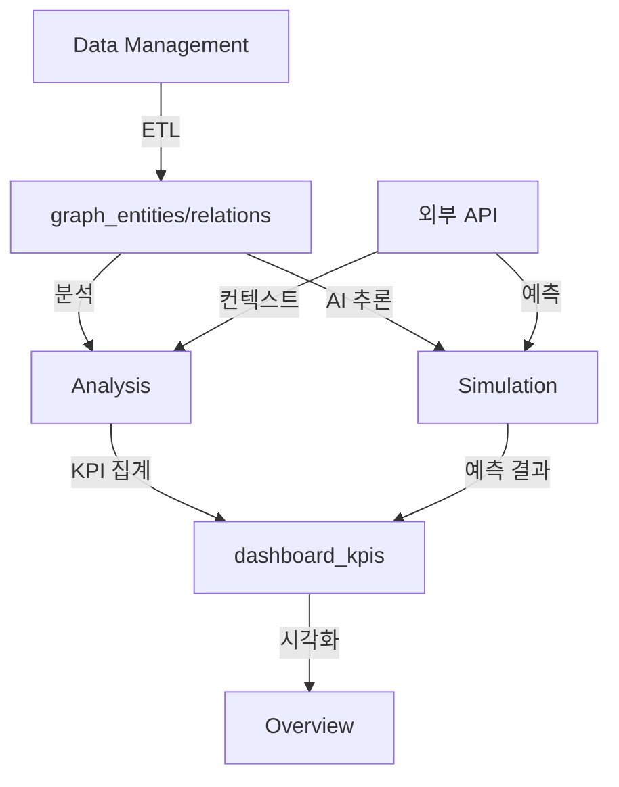

# NEURALTWIN 섹션별 데이터 처리 아키텍처 검토

## 📋 개요

본 문서는 NEURALTWIN 애플리케이션의 4개 섹션(Overview, Analysis, Simulation, Data Management)별 데이터 처리 아키텍처를 분석하고 현재 구현 상태를 검토합니다.

---

## 1️⃣ Overview 섹션

### 🎯 목적
- **현재 비즈니스 상태 이해**
- Analysis/Simulation 결과 요약 및 대시보드 시각화

### 📊 데이터 흐름
```
Analysis/Simulation 결과 (KPI 집계) 
  → dashboard_kpis 테이블
    → 대시보드 시각화
```

### 🗄️ 주요 데이터 소스

#### 1.1 직접 데이터 소스
- `dashboard_kpis` - 집계된 KPI 데이터
- `stores` - 매장 마스터 데이터
- `hq_store_master` - 본사 매장 마스터
- `store_mappings` - 매장 매핑 관계
- `ai_recommendations` - AI 추천 결과

#### 1.2 외부 API 활용 방식
- ❌ 직접 API 호출 없음
- ✅ Analysis/Simulation에서 계산된 결과만 표시
- ✅ 컨텍스트가 반영된 KPI 요약값 사용

### 🔧 현재 구현 상태

#### Hook: `useDashboardKPI.ts`
```typescript
// 단일 날짜 KPI
useDashboardKPI(storeId, date)

// 최근 N일 KPI
useLatestKPIs(storeId, limit)

// 날짜 범위 KPI
useKPIsByDateRange(storeId, startDate, endDate)
```

#### 데이터 구조
```typescript
interface DashboardKPI {
  // 기본 메트릭
  total_revenue: number;
  total_visits: number;
  total_purchases: number;
  conversion_rate: number;
  sales_per_sqm: number;
  labor_hours: number;
  
  // 퍼널 데이터
  funnel_entry: number;
  funnel_browse: number;
  funnel_fitting: number;
  funnel_purchase: number;
  funnel_return: number;
  
  // 외부 컨텍스트 (간접 반영)
  weather_condition?: string;
  is_holiday: boolean;
  special_event?: string;
  consumer_sentiment_index?: number;
}
```

#### Edge Function: `aggregate-dashboard-kpis`
- **역할**: user_data_imports에서 KPI 집계
- **입력**: store_id, date
- **출력**: dashboard_kpis 레코드 생성/업데이트

### ✅ 아키텍처 적합성
- ✅ Analysis/Simulation 결과 요약 표시
- ✅ 외부 API 간접 활용 (컨텍스트 반영된 KPI)
- ✅ 직접 API 호출 없음
- ✅ 단순 읽기 전용 대시보드

---

## 2️⃣ Analysis 섹션

### 🎯 목적
- **현재 문제 파악**
- 임포트 데이터 + 외부 API 컨텍스트 → 통계 분석 → 시각화

### 📊 데이터 흐름
```
임포트 데이터 (user_data_imports, graph_entities)
  + 외부 API 컨텍스트 (weather, holidays, regional, economic)
    → 집계 & 분석
      → 통계 연산
        → 차트/테이블 시각화
```

### 🗄️ 주요 데이터 소스

#### 2.1 직접 데이터 소스
- `user_data_imports` - 업로드 데이터 (고객, 상품, 구매, 방문, 직원)
- `graph_entities` - 온톨로지 엔티티 (Customer, Product, Visit, Purchase 등)
- `graph_relations` - 엔티티 간 관계
- `wifi_tracking` - WiFi 트래킹 데이터
- `wifi_zones` - WiFi 존 정의
- `stores` - 매장 메타데이터

#### 2.2 외부 API 컨텍스트 테이블
- `weather_data` - 날씨 데이터 (온도, 습도, 강수량, 풍속, 날씨 상태)
- `holidays_events` - 공휴일/이벤트 (날짜, 이벤트명, 유형, 영향도)
- `regional_data` - 지역/상권 데이터 (유동인구, 상권 트래픽)
- `economic_indicators` - 경제지표 (소비자심리지수, GDP, 물가지수 등)

### 🔧 현재 구현 상태

#### Hook: `useStoreData.ts`
```typescript
// 단일 파일 로드
useStoreDataFile<K>(fileType: K)
  → customers, products, purchases, visits, staff, wifi_sensors, wifi_tracking

// 전체 데이터셋 로드
useStoreDataset()
  → { customers, products, purchases, visits, staff }

// 여러 파일 동시 로드
useMultipleStoreDataFiles(fileTypes)
```

#### Hook: `useFootfallAnalysis.ts`
```typescript
// 방문자 분석 + 외부 컨텍스트 조인
useFootfallAnalysis(storeId, startDate, endDate)
  → {
      data: FootfallData[], // 시간별 방문 + 날씨 + 공휴일 + 상권
      stats: FootfallStats  // 총 방문, 고유 방문자, 피크 시간, 인사이트
    }
```

**데이터 조인 로직:**
```sql
SELECT 
  wifi_tracking.*,
  weather_data.temperature, weather_data.condition,
  holidays_events.event_name,
  regional_data.traffic_index
FROM wifi_tracking
LEFT JOIN weather_data ON date = wifi_tracking.date AND hour
LEFT JOIN holidays_events ON date
LEFT JOIN regional_data ON date
```

**생성 인사이트:**
- 날씨 영향 분석: "비 오는 날 방문 -23%"
- 공휴일 영향 분석: "공휴일 방문 +41%"
- 상권 비교 분석: "상권 평균 대비 +15%"

#### Hook: `useTrafficHeatmap.ts`
```typescript
// 히트맵 데이터 생성
useTrafficHeatmap(storeId, timeOfDay?)
  → HeatPoint[] // { x, y, z, intensity, zone_id }

// 존별 통계
useZoneStatistics(heatPoints, metadata)
  → ZoneStatistics[] // { zone_id, visits, avgIntensity, maxIntensity }

// 트래픽 컨텍스트 분석
useTrafficContext(storeId)
  → string[] // ["비 오는 날 입구 체류 시간 +30%", ...]
```

**외부 API 컨텍스트 활용:**
- 날씨별 동선 패턴 분석
- 이벤트별 핫존 변화 분석
- 지역 트래픽과 비교

#### Hook: `useCustomerJourney.ts`
```typescript
// 고객 여정 분석
useCustomerJourney(storeId, startDate, endDate)
  → {
      paths: JourneyPath[],     // 주요 동선 패턴
      transitions: Transition[], // 존 전환 확률
      dwell: DwellTime[]        // 체류 시간
    }
```

### 🛠️ 주요 기술 스택
- **데이터 페칭**: TanStack Query (useQuery)
- **데이터베이스**: Supabase SELECT (조인, 필터, 집계)
- **시각화**: Recharts (차트), React Three Fiber (3D)
- **연산**: JavaScript/TypeScript (통계 계산)

### ✅ 아키텍처 적합성
- ✅ 실제 업로드 데이터 기반
- ✅ SQL 쿼리 및 통계 연산
- ✅ 외부 API 컨텍스트 조인
- ✅ 실시간 대시보드
- ✅ AI 추론 불필요 (단순 집계 + 컨텍스트)

### ⚠️ 개선 필요 사항
1. **외부 API 테이블 데이터 부족**
   - weather_data, holidays_events 등이 비어있을 수 있음
   - 데모 데이터 생성 필요

2. **컨텍스트 조인 로직 표준화**
   - 각 Hook마다 조인 방식이 다름
   - 공통 유틸리티 함수 필요

3. **캐싱 전략 부재**
   - wifi_heatmap_cache 테이블 활용 안 함
   - 대용량 데이터 성능 이슈 가능성

---

## 3️⃣ Simulation 섹션

### 🎯 목적
- **솔루션 실험**
- 디지털 트윈에서 What-if 시나리오 시뮬레이션

### 📊 데이터 흐름
```
임포트 데이터 (user_data_imports, graph_entities)
  + 온톨로지 스키마 (entity_types, relation_types)
  + 외부 API 예측 (날씨 예보, 이벤트 일정, 경제 전망)
  + 시뮬레이션 파라미터 (레이아웃, 가격, 재고 등)
    → AI 고급 추론 (Edge Function)
      → AI 예측 결과 (ΔCVR, ΔATV, ΔSales)
        → KPI 변화 시각화
```

### 🗄️ 주요 데이터 소스

#### 3.1 직접 데이터 소스
- `user_data_imports` - 기존 데이터
- `graph_entities` - 온톨로지 엔티티
- `graph_relations` - 엔티티 관계
- `ontology_entity_types` - 엔티티 타입 스키마
- `ontology_relation_types` - 관계 타입 스키마
- `ai_scene_analysis` - AI 분석 이력
- `store_scenes` - 3D 씬 레시피

#### 3.2 외부 API 예측 데이터
- `weather_data` (미래): 날씨 예보 데이터
- `holidays_events` (미래): 이벤트 일정
- `economic_indicators` (미래): 경제 전망

### 🔧 현재 구현 상태

#### Hook: `useOntologyData.ts`
```typescript
// 엔티티 조회 (매장별 필터링)
useOntologyEntities(entityTypeName?)
  → graph_entities[]

// 관계 조회 (매장별 필터링)
useOntologyRelations(sourceType?, targetType?)
  → graph_relations[]

// N-hop 그래프 탐색
useGraphNHop(startEntityId, maxHops)
  → { nodes: [], edges: [], paths: [] }

// AI 추론용 그래프 데이터 변환
transformToGraphData(entities, relations)
  → { nodes: [], edges: [] }
```

#### Hook: `useStoreScene.ts`
```typescript
// 씬 레시피 로드
useStoreScene(storeId)
  → {
      recipe: SceneRecipe,
      instances: ModelInstance[],
      zones: Zone[],
      metadata: StoreSpaceMetadata
    }
```

#### Edge Function: `advanced-ai-inference`
**역할**: AI 고급 추론 (Lovable AI - gemini-2.5-pro / gpt-5)

**입력:**
```typescript
{
  storeId: string,
  scenarioType: "layout" | "demand" | "pricing" | "recommendation",
  ontologyGraph: { nodes: [], edges: [] },
  baselineData: { visits, purchases, ... },
  externalContext: { weather, events, economic },
  simulationParams: { ... }
}
```

**출력:**
```typescript
{
  predictions: {
    deltaConversionRate: number,
    deltaATV: number,
    deltaSales: number,
    confidence: number
  },
  insights: string[],
  recommendations: string[]
}
```

#### 시뮬레이션 페이지 (현재 구현 필요)

1. **Digital Twin 3D** (`/digital-twin-3d`)
   - ✅ 구현 완료
   - 3D 씬 뷰어, 오버레이 관리

2. **Scenario Lab** (`/simulation/twin-lab`)
   - ⬜ AI 추론 연동 필요
   - What-if 시나리오 생성

3. **Layout Simulation** (`/simulation/layout`)
   - ⬜ AI 추론 연동 필요
   - 레이아웃 변경 시뮬레이션

4. **Demand & Inventory Sim** (`/simulation/demand-inventory`)
   - ⬜ AI 추론 연동 필요
   - 수요 예측, 재고 최적화

5. **Price Optimization Sim** (`/simulation/pricing`)
   - ⬜ AI 추론 연동 필요
   - 가격 탄력성 모델링

6. **Recommendation Strategy** (`/simulation/recommendation`)
   - ⬜ AI 추론 연동 필요
   - 추천 전략 시뮬레이션

### 🛠️ 주요 기술 스택
- **AI 추론**: Lovable AI (google/gemini-2.5-pro, openai/gpt-5)
- **백엔드**: Edge Functions (advanced-ai-inference)
- **그래프 쿼리**: Supabase RPC (graph_n_hop_query)
- **3D 시각화**: React Three Fiber, @react-three/drei
- **데이터 페칭**: TanStack Query

### ✅ 아키텍처 적합성
- ✅ 온톨로지 그래프 기반 컨텍스트
- ✅ 외부 API 예측 데이터 활용
- ✅ AI 고급 추론 (Lovable AI)
- ✅ What-if 시나리오 생성

### ⚠️ 개선 필요 사항
1. **AI 추론 Edge Function 미완성**
   - `advanced-ai-inference` 기능 구현 필요
   - Lovable AI 모델 선택 로직 추가

2. **시뮬레이션 페이지 미구현**
   - Scenario Lab, Layout Sim 등 UI 구현 필요
   - AI 추론 결과 시각화 컴포넌트 필요

3. **외부 API 예측 데이터 수집**
   - 날씨 예보 API 연동 필요
   - 경제 전망 데이터 수집 필요

4. **온톨로지 스키마 검증**
   - 시뮬레이션에 필요한 엔티티 타입 정의 필요
   - 관계 타입 스키마 검증 필요

---

## 4️⃣ Data Management 섹션

### 🎯 목적
- **데이터 인프라 관리**
- 외부 데이터 수집, 변환, 온톨로지 매핑, 저장

### 📊 데이터 흐름
```
외부 데이터 (CSV, Excel, API)
  → ETL/변환 (Edge Function: schema-etl, auto-map-etl)
    → 온톨로지 매핑 (Entity/Relation 생성)
      → Supabase 저장 (graph_entities, graph_relations)
```

### 🗄️ 주요 데이터 소스

#### 4.1 입력 데이터 소스
- CSV/Excel 파일 업로드
- 외부 API (BigData API 연동)
- WiFi 센서 데이터 (NeuralSense)

#### 4.2 출력 데이터 저장
- `user_data_imports` - 원본 데이터 저장
- `graph_entities` - 온톨로지 엔티티
- `graph_relations` - 온톨로지 관계
- `wifi_tracking` - WiFi 트래킹 데이터
- `wifi_raw_signals` - WiFi 신호 원본

### 🔧 현재 구현 상태

#### 페이지: Unified Data Import (`/data-import`)
- ✅ CSV/Excel 파일 업로드
- ✅ 데이터 검증 및 미리보기
- ✅ 스키마 매핑
- ✅ 온톨로지 변환

#### 페이지: Schema Builder (`/schema-builder`)
- ✅ 엔티티 타입 관리
- ✅ 관계 타입 관리
- ✅ 스키마 버전 관리
- ✅ 그래프 시각화

#### 페이지: Graph Analysis (`/graph-analysis`)
- ✅ 그래프 쿼리 빌더
- ✅ N-hop 탐색
- ✅ 최단 경로 찾기

#### 페이지: BigData API (`/bigdata-api`)
- ✅ 외부 데이터 소스 관리
- ✅ 동기화 스케줄 설정
- ⬜ 실제 API 연동 필요

#### 페이지: Analytics Backend (`/analytics`)
- ⬜ 분석 백엔드 UI 구현 필요
- ⬜ KPI 집계 트리거 설정

#### Edge Functions

1. **schema-etl**
   - ✅ 구현 완료
   - CSV/Excel → graph_entities/relations 변환

2. **auto-map-etl**
   - ✅ 구현 완료
   - 자동 스키마 매핑

3. **import-with-ontology**
   - ✅ 구현 완료
   - 온톨로지 기반 임포트

4. **process-wifi-data**
   - ✅ 구현 완료
   - WiFi 신호 → 좌표 변환

### ✅ 아키텍처 적합성
- ✅ 외부 데이터 수집 및 변환
- ✅ 온톨로지 매핑
- ✅ ETL 파이프라인
- ✅ Supabase 저장

### ⚠️ 개선 필요 사항
1. **BigData API 실제 연동**
   - 날씨 API (OpenWeatherMap 등)
   - 공휴일 API (한국천문연구원 등)
   - 경제 API (한국은행 등)

2. **Analytics Backend UI**
   - KPI 집계 관리 UI
   - Edge Function 트리거 설정

3. **데이터 품질 검증**
   - 중복 데이터 제거
   - 데이터 정합성 검증

---

## 🔄 섹션 간 데이터 흐름



### 데이터 처리 계층

1. **원본 데이터** (Data Management)
   - user_data_imports
   - wifi_raw_signals
   - external_data_sources

2. **온톨로지 데이터** (Data Management → All)
   - graph_entities
   - graph_relations
   - ontology_entity_types
   - ontology_relation_types

3. **컨텍스트 데이터** (Data Management → Analysis/Simulation)
   - weather_data
   - holidays_events
   - regional_data
   - economic_indicators

4. **분석 결과** (Analysis → Overview)
   - dashboard_kpis
   - funnel_metrics
   - analysis_history

5. **AI 결과** (Simulation → Overview)
   - ai_scene_analysis
   - ai_recommendations

---

## 📊 요약 및 권장사항

### ✅ 잘 구현된 부분

1. **Overview 섹션**
   - KPI 대시보드 완성도 높음
   - 외부 컨텍스트 간접 반영 잘됨

2. **Analysis 섹션**
   - 데이터 페칭 Hook 체계적
   - 외부 API 컨텍스트 조인 구조 명확

3. **Data Management 섹션**
   - 온톨로지 기반 ETL 완성도 높음
   - 스키마 관리 체계적

### ⚠️ 개선 필요 부분

1. **Simulation 섹션 (최우선)**
   - AI 추론 Edge Function 구현
   - 시뮬레이션 페이지 UI 구현
   - 온톨로지 스키마 검증

2. **외부 API 데이터**
   - 실제 API 연동 (날씨, 공휴일, 경제)
   - 데모 데이터 생성 스크립트
   - 예측 데이터 수집 로직

3. **성능 최적화**
   - wifi_heatmap_cache 활용
   - 대용량 데이터 페이징
   - 쿼리 최적화

### 🎯 다음 단계 (Phase 2-5 준비)

1. **Week 2-3: Overview & Analysis 마이그레이션**
   - 외부 API 데모 데이터 생성
   - 컨텍스트 조인 유틸리티 함수 표준화
   - 성능 최적화

2. **Week 4-5: Simulation 섹션 구축**
   - AI 추론 Edge Function 구현
   - 시뮬레이션 페이지 UI 구현
   - 온톨로지 스키마 검증

3. **Week 6-7: 추가 Simulation 기능**
   - Layout, Demand, Pricing, Recommendation Sim
   - AI 모델 파인튜닝
   - 예측 정확도 검증

4. **Week 8: 최적화 & QA**
   - 전체 아키텍처 리뷰
   - 성능 테스트
   - 사용자 테스트
